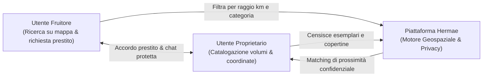
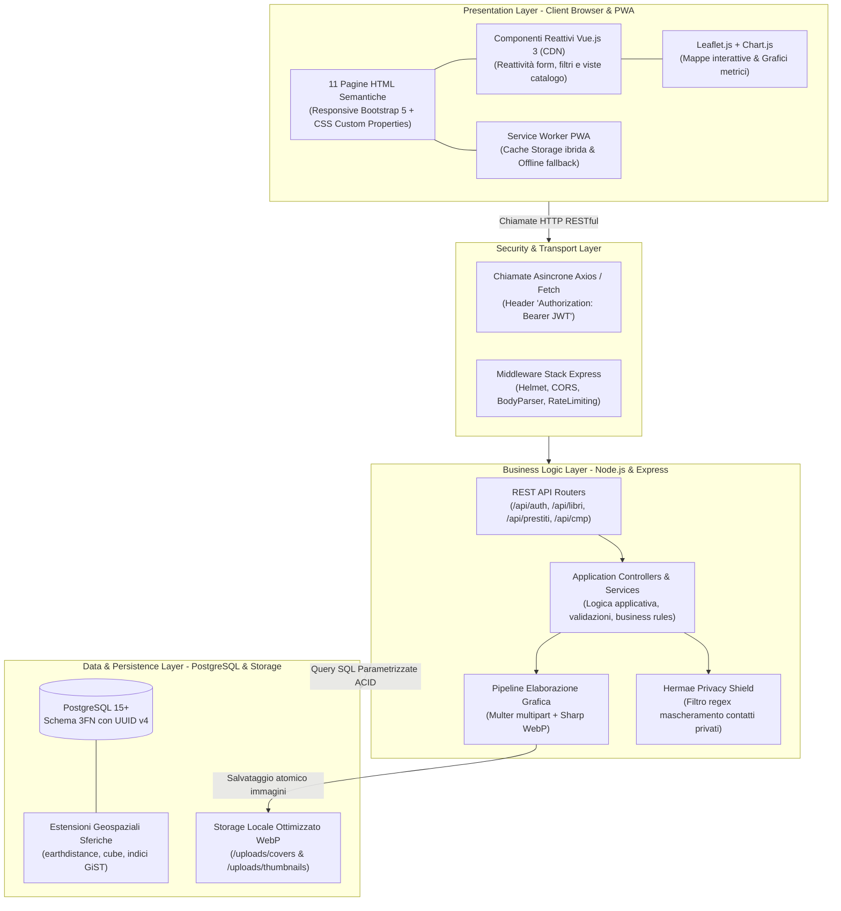
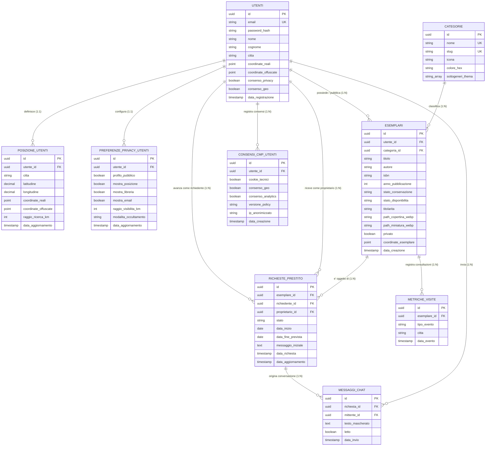
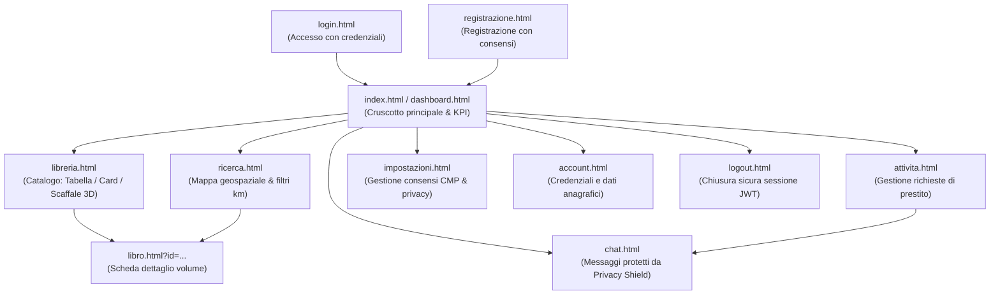

# HERMAE — Rapporto Tecnico di Progetto
## Piattaforma di Geolocalizzazione Culturale per la Condivisione del Patrimonio Librario Privato

> **Corso di Studio:** Laurea Triennale in Informatica per le Aziende Digitali (L-31)  
> **Tema n. 4:** Sharing technologies | **Traccia PW n. 14:** Sviluppo di un software di geolocalizzazione culturale per condividere il patrimonio librario degli utenti privati  
> **Progetto:** Hermae — *"Il sapere, un libro alla volta"*  
> **Candidato:** Nunzio Giglio (Matr. 0312200894)  
> **Repository Ufficiale GitHub:** [https://github.com/Nunzy00/Hermae_Nunzio_Giglio_0312200894](https://github.com/Nunzy00/Hermae_Nunzio_Giglio_0312200894)  
> **Licenza:** Tutti i diritti riservati (All Rights Reserved) — © 2026 Nunzio Giglio  

---

## Indice del Documento
1. **Analisi del Contesto Operativo e Scelta dell'Ambito**
   - 1.1 Inquadramento e Situazione-Problema
   - 1.2 Delimitazione dell'Ambito: Città, Quartiere e Comunità Tematiche
   - 1.3 Attori e Dinamiche dello Spazio Operativo
   - 1.4 Fattori Critici e Vincoli di Dominio
2. **Requisiti di Sistema (Funzionali e Non Funzionali)**
   - 2.1 Metodologia di Classificazione (MoSCoW)
   - 2.2 Matrice dei Requisiti Funzionali (RF)
   - 2.3 Matrice dei Requisiti Non Funzionali (RNF)
   - 2.4 Vincoli Qualitativi, Normativi ed Accessibilità
3. **Scelta dell'Architettura, delle Tecnologie e Modellazione Dati**
   - 3.1 Modello Architetturale a Livelli (Layered Architecture & REST)
   - 3.2 Tech Stack Selezionato e Motivazioni Ingegneristiche
   - 3.3 Pipeline Multimediale e Gestione Storage Copertine (Sharp WebP)
   - 3.4 Modello Concettuale Entità-Relazione (E-R) e Ontologia IFLA LRM
   - 3.5 Schema Logico-Relazionale, Motore Geospaziale e DDL PostgreSQL
4. **Scelte di Design UX, Accessibilità e Tutela della Privacy**
   - 4.1 Filosofia Mobile-First ed Ergonomia dell'Interfaccia
   - 4.2 Mappa di Navigazione dell'Applicazione (Sitemap a 11 Pagine)
   - 4.3 Accessibilità Universale (W3C WCAG 2.1 Livello AA e WAI-ARIA)
   - 4.4 Semantica Web Schema.org e Riservatezza dei Dati di Posizione
   - 4.5 Modelli di Tutela della Privacy: Spatial Blurring, Hermae Privacy Shield e CMP

---

## 1. Analisi del Contesto Operativo e Scelta dell'Ambito

### 1.1 Inquadramento e Situazione-Problema
Il patrimonio librario custodito nelle biblioteche domestiche dei privati cittadini (opere letterarie, saggi accademici, manualistica specialistica, collezioni storiche) rappresenta un immenso capitale culturale capillarmente distribuito sul territorio, che tuttavia versa in una condizione di **cronica invisibilità, frammentazione e sottoutilizzo**.

Tale scenario genera una marcata **asimmetria informativa di prossimità**:
- **Assenza di canali digitali dedicati:** Mancano strumenti aperti e gratuiti per censire, localizzare e condividere i volumi posseduti dai cittadini all'interno della propria comunità;
- **Opacità della disponibilità a corto raggio:** I lettori non hanno alcun mezzo per sapere se un libro ricercato sia posseduto da un vicino di casa o da una persona residente a poche centinaia di metri;
- **Inefficienza dei canali alternativi:** Le biblioteche pubbliche presentano spesso vincoli orari stringenti, limitazioni catalografiche e barriere burocratiche; d'altro canto, i mercati commerciali online impongono commissioni, attese di spedizione e imballaggi che annullano l'economicità e la spontaneità dello scambio locale.

**Hermae** nasce per risolvere questa criticità mediante le *Sharing Technologies*, offrendo un software di **geolocalizzazione culturale** concepito per abilitare la catalogazione, la scoperta cartografica e il prestito fiduciario peer-to-peer a chilometro zero.

### 1.2 Delimitazione dell'Ambito: Città, Quartiere e Comunità Tematiche
L'ambito operativo di Hermae è calibrato sull'integrazione sinergica tra la dimensione cittadina e la scala di quartiere:
- **La Città e il Tessuto Urbano:** La città costituisce il perimetro naturale del servizio. L'infrastruttura software è progettata per gestire volumi crescenti di dati (scalabilità urbana), supportando la ricerca di testi sull'intero agglomerato municipale;
- **La Prossimità di Quartiere:** All'interno della maglia cittadina, il nucleo focale dello scambio opera a raggio corto (500 metri – 5 chilometri). Questa distanza consente il ritiro e la restituzione fisica del testo a piedi, in bicicletta o tramite trasporto pubblico, azzerando le barriere economiche e l'impatto ambientale legato alla logistica;
- **Comunità Tematiche e Universitarie:** Gli ambienti accademici (campus, studentati) e i circoli culturali locali sono inquadrati come sottoinsiemi impliciti del contesto urbano, trovando nella piattaforma un canale naturale per lo scambio circolare di dispense e costosi testi d'esame.

### 1.3 Attori e Dinamiche dello Spazio Operativo
Il sistema modella l'interazione diretta e orizzontale tra due ruoli primari:



- **Utente Proprietario (Condivisore):** Registra il proprio profilo, rilascia i consensi informati, cataloga i libri specificando metadati e stato d'uso, carica la fotografia della copertina e definisce la disponibilità dell'esemplare;
- **Utente Fruitore (Richiedente):** Consulta la mappa interattiva o l'elenco tabellare, imposta il raggio di vicinanza, consulta la scheda dell'opera con l'anteprima WebP e avvia la richiesta formale di prestito e contatto.

### 1.4 Fattori Critici e Vincoli di Dominio
1. **Aggregazione Orientata alla Cultura e non al Commercio:** A differenza dei marketplace tradizionali, Hermae mette al centro la conoscenza del testo: l'utente ricerca prima il titolo o l'argomento d'interesse e, solo in seconda battuta, individua le copie fisiche disponibili nell'area urbana circostante;
2. **Riservatezza Domiciliare (Privacy by Design - GDPR):** Trattandosi di volumi custoditi presso abitazioni private, la piattaforma tutela tassativamente l'inviolabilità del domicilio attraverso un algoritmo di offuscamento spaziale, evitando l'esposizione pubblica del civico esatto;
3. **Inclusione e Accessibilità Universale (WCAG 2.1 AA):** L'applicazione deve garantire usabilità totale su dispositivi mobili e piena operatività con tecnologie assistive (screen reader, navigazione da tastiera);
4. **Sostenibilità Digitale ed Efficienza Media:** La fruizione in mobilità impone tempi di caricamento istantanei e minimi consumi di traffico dati, traguardati tramite formati grafici WebP compressi e indici spaziali ad albero GiST.

---

## 2. Requisiti di Sistema (Funzionali e Non Funzionali)

### 2.1 Metodologia di Classificazione (MoSCoW)
I requisiti sono stati formalizzati e prioritizzati secondo il framework standard MoSCoW:
- **Must have (M):** Requisiti irrinunciabili e vincolanti per il rilascio del prototipo operativo;
- **Should have (S):** Requisiti ad alta priorità per l'efficacia e la robustezza applicativa;
- **Could have (C):** Requisiti a valore aggiunto implementati a completamento dell'esperienza utente;
- **Won't have (W):** Requisiti differiti a future iterazioni evolutive.

### 2.2 Matrice dei Requisiti Funzionali (RF)

| ID | Requisito Funzionale | Descrizione e Comportamento Operativo | Priorità | Modulo Architetturale |
| :---: | :--- | :--- | :---: | :--- |
| **RF-1** | **Autenticazione & Gestione Profilo** | Registrazione utenti con validazione email, cifratura password (bcrypt), emissione e verifica di token JWT firmati, gestione profilo e raccolta granulare dei consensi. | **Must** | `authController` / `jwt` / `bcrypt` |
| **RF-2** | **Geolocalizzazione dell'Utente** | Rilevamento della posizione tramite Geolocation API del browser o inserimento coordinate manuale, persistenza relazionale WGS 84 e associazione al profilo. | **Must** | `posizioneController` / `PostgreSQL` |
| **RF-3** | **Gestione Catalogo (CRUD Libri)** | Creazione, lettura, modifica e cancellazione della scheda volume: metadati bibliografici, categorizzazione Thema a 2 livelli, stato di conservazione e titolarità. | **Must** | `esemplariService` / `PostgreSQL` |
| **RF-4** | **Pipeline Immagini e Miniature** | Upload multipart di immagini con convalida MIME, ridimensionamento asincrono in memoria e conversione in formato compresso WebP (copertina 800px e miniatura 200px). | **Must** | `uploadMiddleware` / `Sharp` |
| **RF-5** | **Motore di Ricerca Testuale** | Ricerca full-text e filtri combinati per titolo, autore, codice ISBN e categoria tematica, integrata sia nella vista catalogo sia nella vista mappa. | **Must** | `searchController` / SQL Parametrizzato |
| **RF-6** | **Ricerca Geospaziale di Prossimità** | Visualizzazione interattiva su mappa Leaflet con marker personalizzati e filtraggio spaziale in tempo reale per raggio chilometrico (1–50 km) tramite indici GiST. | **Must** | `earthdistance` / `Leaflet.js` |
| **RF-7** | **Scheda Dettaglio con Anteprima** | Pagina dedicata con URL univoco, anteprima grafica WebP, metadati IFLA LRM, distanza chilometrica stimata e raggio di confidenzialità. | **Must** | `libro.html` / `Vue.js 3` |
| **RF-8** | **Gestione Scambi e Prestiti** | Flusso formale di richiesta prestito protetto da lock pessimistico SQL (`SELECT ... FOR UPDATE`), gestione stati (`IN_ATTESA`, `ACCETTATO`, `RIFIUTATO`, `CONCLUSO`) e chat interna. | **Should** | `prestitiService` / `chatController` |
| **RF-9** | **Dashboard Telemetria e Analytics** | Cruscotto personale con indicatori KPI aggregati (volumi attivi, lettori raggiunti, prestiti) e grafici statistici interattivi Chart.js (trend mensile spline e generi). | **Should** | `dashboard.html` / `Chart.js` |
| **RF-10**| **PWA & Fruizione Offline** | Supporto all'installazione dell'app (manifest W3C), Service Worker per il caching ibrido delle risorse e pagina di cortesia offline in assenza di connessione. | **Could** | `service-worker.js` / `manifest.json` |
| **RF-11**| **Consent Management Platform (CMP)**| Banner e pannello di controllo per l'acquisizione, il tracciamento conforme e la revoca istantanea delle preferenze cookie e consensi senza dark pattern. | **Must** | `cmp.js` / `consensi_cmp_utenti` |

### 2.3 Matrice dei Requisiti Non Funzionali (RNF)

| ID | Categoria RNF | Parametro di Verifica | Descrizione e Criteri di Accettazione | Priorità |
| :---: | :--- | :--- | :--- | :---: |
| **RNF-1** | **Accessibilità Digitale** | **W3C WCAG 2.1 AA / WAI-ARIA** | Rapporto di contrasto testo/sfondo $\ge 4.5:1$, navigabilità sequenziale da tastiera (focus rinforzato), skip link, attributi semantici e tabelle alternative accessibili a mappe e grafici. | **Must** |
| **RNF-2** | **Privacy by Design & Default**| **Regolamento UE 2016/679 (GDPR)** | Riservatezza domiciliare tramite algoritmo di *Spatial Blurring* (offuscamento casuale 300–500 m), opzione libreria privata, filtro chat anti-adescamento e conformità ePrivacy. | **Must** |
| **RNF-3** | **Prestazioni ed Efficienza** | **Web Vitals & Metriche DB** | - Risposta query geospaziali con indici GiST: **< 200 ms** (media reale < 2 ms).<br>- Compressione immagini WebP: risparmio banda **$\ge 70\%$**.<br>- First Contentful Paint: **< 1.0 s**. | **Must** |
| **RNF-4** | **Usabilità & Mobile-First** | **Design Responsive & Touch** | Interfaccia ottimizzata prioritariamente per smartphone e tablet; comandi touch con target $\ge 44 \times 44$ px; commutazione tra 3 modalità di vista (Tabella, Card, Scaffale 3D). | **Must** |
| **RNF-5** | **Sicurezza Applicativa** | **Standard OWASP Top 10** | Password conservate con hash crittografico adattivo bcrypt (10 salt rounds); token JWT firmati HMAC-SHA256; query SQL parametrizzate contro SQL Injection; header HTTP Helmet e CORS. | **Must** |
| **RNF-6** | **Manutenibilità & Modularità** | **Layered Architecture** | Chiara separazione client-server: front-end multi-pagina reattivo disaccoppiato da back-end Express suddiviso in *Routes*, *Controllers*, *Services* e *Middlewares*. | **Must** |
| **RNF-7** | **Integrità Transazionale** | **Proprietà ACID** | Transizioni di stato dei prestiti incapsulate in transazioni SQL atomiche con lock pessimistico di riga, impedendo assegnazioni duplicate del medesimo esemplare fisico. | **Must** |

---

## 3. Scelta dell'Architettura, delle Tecnologie e Modellazione Dati

### 3.1 Modello Architetturale Generale
Il sistema è ingegnerizzato secondo il modello architetturale **Client-Server disaccoppiato a tre livelli (Layered Architecture)**, con comunicazioni stateless regolate dal paradigma **REST (Representational State Transfer)**:



- **Front-end Multi-Pagina Reattivo:** Articolato su file HTML dedicati per valorizzare le funzionalità native del browser (cronologia, tasti avanti/indietro, ricarica e bookmarking), integrando istanze progressive di **Vue.js 3** per la gestione reattiva delle viste;
- **Back-end Modulare:** Server Node.js con Express che espone endpoint JSON stateless, garantendo totale indipendenza tra la logica di business e l'interfaccia utente;
- **Persistenza Relazionale Geospaziale:** PostgreSQL governa la consistenza dei dati, affiancato da un motore di calcolo geodesico su superfici sferiche.

### 3.2 Tech Stack Selezionato e Motivazioni Ingegneristiche

| Componente Architetturale | Tecnologia Selezionata | Versione | Motivazione della Scelta e Valore Ingegneristico |
| :--- | :--- | :---: | :--- |
| **Ambiente di Runtime** | **Node.js** | 18+ LTS | Runtime asincrono non bloccante basato su motore V8, ideale per carichi I/O intensivi con minimo footprint di memoria. |
| **Web Framework** | **Express.js** | 4.18.2 | Microframework industriale standard per la creazione di API RESTful modulari, con supporto esteso a middleware di sicurezza. |
| **DBMS Relazionale** | **PostgreSQL** | 15+ | Massima garanzia di consistenza ACID, supporto nativo a chiavi primarie UUID e flessibilità nell'indicizzazione avanzata. |
| **Estensioni Spaziali** | **earthdistance + cube** | Native PG | Calcolo geodetico su coordinate sferiche terrestri senza il pesante overhead di installazione e dipendenze binarie di PostGIS. |
| **Indice Spaziale** | **GiST (btree_gist)** | Nativo PG | Albero di ricerca generalizzato su `ll_to_earth()` che riduce la complessità di ricerca radiale a $O(\log N)$ con tempi < 2 ms. |
| **Front-end Reattivo** | **Vue.js 3** | 3.3.4 (CDN)| Reattività mirata senza complessi bundler di compilazione (Vite/Webpack), First Contentful Paint < 1s e zero build-time. |
| **Framework UI / CSS** | **Bootstrap 5** | 5.3.2 | Griglia responsive flessibile e componenti accessibili conformi alle linee guida W3C WAI-ARIA. |
| **Motore Cartografico** | **Leaflet.js + OSM** | 1.9.4 | Libreria cartografica client-side leggera e aperta basata sui tile liberi di OpenStreetMap, priva di costi o chiavi API commerciali. |
| **Visualizzazione Dati** | **Chart.js** | 4.4.0 | Rendering di grafici interattivi su canvas HTML5 per l'analisi visiva delle metriche d'uso e della circolazione libraria. |
| **Transcodifica Media** | **Sharp (libvips)** | 0.33.x | Pipeline ad altissime prestazioni in C per la transcodifica asincrona in WebP in memoria, abbattendo del 70% il consumo di banda. |
| **Autenticazione & Hash** | **Bcrypt + JWT** | 5.1 / 9.0 | Soluzione autonoma senza BaaS proprietari (zero vendor lock-in): salting adattivo a 10 cicli e token stateless RFC 7519. |

### 3.3 Pipeline Multimediale e Gestione Storage Immagini
1. **Acquisizione e Whitelist (Multer):** L'upload multipart intercetta il file direttamente in memoria buffer (`MemoryStorage`), applicando un controllo rigoroso sul MIME type limitato a `image/jpeg`, `image/png` e `image/webp`. Qualsiasi file non conforme o potenzialmente nocivo viene scartato a monte;
2. **Transcodifica Asincrona (Sharp):** Il buffer viene processato asincronamente dalla libreria Sharp, transcodificando l'immagine nel formato compresso moderno **WebP** e generando contestualmente due asset distinti:
   - **Copertina di Dettaglio:** Risoluzione massima di $800 \times 1200$ pixel con qualità bilanciata (80%), salvata nella cartella `/uploads/covers/`;
   - **Miniatura Dorsale (Thumbnail):** Risoluzione di $200 \times 300$ pixel per l'impiego nelle card, nei popup della mappa e nello scaffale 3D, salvata in `/uploads/thumbnails/`;
3. **Cancellazione Atomica Anti-Orfani:** Il sistema associa a ogni cancellazione o aggiornamento del libro una procedura atomica lato filesystem (`fs.unlink`), garantendo la rimozione immediata dei vecchi file WebP e prevenendo la saturazione dello spazio di archiviazione del server.

### 3.4 Modello Concettuale Entità-Relazione (E-R)
Il modello concettuale traduce fedelmente il dominio bibliografico secondo lo standard **IFLA LRM** (*Library Reference Model*), separando l'astrazione dell'opera intellettuale dal singolo `ESEMPLARE` fisico posseduto dal privato cittadino:



### 3.5 Schema Logico-Relazionale, Motore Geospaziale e DDL PostgreSQL
Lo schema relazionale rispetta integralmente la **Terza Forma Normale (3FN)**:
1. **Identificatori Universali UUID:** Tutte le entità adottano chiavi primarie `UUID v4` generate crittograficamente con `gen_random_uuid()`, prevenendo vulnerabilità di enumerazione e attacchi IDOR (*Insecure Direct Object References*);
2. **Motore Geospaziale e Indici GiST:** Il calcolo geodetico sfrutta l'operatore `<@>` dell'estensione `earthdistance`, che misura la distanza di grande cerchio sulla superficie sferica terrestre in miglia (convertite in metri). L'indice spaziale:
   ```sql
   CREATE INDEX idx_posizione_utenti_gist_earth 
   ON posizione_utenti USING gist (ll_to_earth(latitudine, longitudine));
   ```
   consente l'esecuzione di query radiali del tipo:
   ```sql
   SELECT e.*, (earth_distance(ll_to_earth(p.latitudine, p.longitudine), 
                              ll_to_earth($1, $2))) AS distanza_metri
   FROM esemplari e
   JOIN posizione_utenti p ON e.utente_id = p.utente_id
   WHERE earth_box(ll_to_earth($1, $2), $3) @> ll_to_earth(p.latitudine, p.longitudine)
     AND earth_distance(ll_to_earth($1, $2), ll_to_earth(p.latitudine, p.longitudine)) <= $3
   ORDER BY distanza_metri ASC;
   ```
   ottenendo risposte stabili entro 1.5–2 millisecondi anche in presenza di migliaia di record.
3. **Lock Pessimistico Transazionale (ACID):** L'approvazione delle richieste di prestito è incapsulata in una transazione che blocca la riga dell'esemplare:
   ```sql
   BEGIN;
   SELECT id, stato_disponibilita FROM esemplari WHERE id = $1 FOR UPDATE;
   -- Se disponibile, aggiorna stato esemplare e richiesta:
   UPDATE esemplari SET stato_disponibilita = 'IN_PRESTITO' WHERE id = $1;
   UPDATE richieste_prestito SET stato = 'ACCETTATA' WHERE id = $2;
   -- Rifiuta atomicamente tutte le altre richieste pendenti per lo stesso libro:
   UPDATE richieste_prestito SET stato = 'RIFIUTATA' 
   WHERE esemplare_id = $1 AND id <> $2 AND stato = 'IN_ATTESA';
   COMMIT;
   ```

---

## 4. Scelte di Design UX, Accessibilità e Tutela della Privacy

### 4.1 Filosofia Mobile-First ed Ergonomia dell'Interfaccia
L'interfaccia utente di Hermae è concepita seguendo una rigorosa filosofia **Mobile-First**:
- **Progettazione per Schermi Touch:** Tutti gli elementi cliccabili (pulsanti di azione, collegamenti, slider per il raggio chilometrico e marker su mappa) garantiscono un'area di contatto minima di **$44 \times 44$ pixel**, prevenendo tocchi accidentali;
- **Layout Fluido e Responsive:** La combinazione di Bootstrap 5, CSS Grid e Flexbox permette all'interfaccia di riorganizzarsi fluidamente dal display verticale di uno smartphone (colonna singola e controlli collassabili) fino ai monitor desktop ad alta risoluzione (griglie multi-colonna a 12 colonne);
- **Tre Modalità di Fruizione del Catalogo:** Nella pagina della libreria personale (`libreria.html`) l'utente può commutare istantaneamente tra 3 viste complementari:
  1. *Vista Tabella:* Massima densità informativa, ideale per la gestione rapida e pienamente accessibile da screen reader;
  2. *Vista Card:* Visualizzazione grafica moderna con copertine WebP, badge cromatici di genere e indicatori di stato;
  3. *Vista Scaffale 3D:* Rappresentazione prospettica immersiva che simula un autentico scaffale librario in legno con dorsi dei libri verticali.

### 4.2 Mappa di Navigazione dell'Applicazione (Sitemap a 11 Pagine)
L'architettura front-end multi-pagina è articolata su 11 viste specializzate con controllo di accesso (gatekeeping JWT):



### 4.3 Accessibilità Universale (W3C WCAG 2.1 Livello AA e WAI-ARIA)
La piattaforma Hermae è stata progettata per garantire parità di accesso a tutti i cittadini, conformemente ai criteri di successo **WCAG 2.1 Livello AA**:
- **Percepibilità e Contrasti Cromatici:** Rispetto sistematico del rapporto di contrasto minimo di **$4.5:1$** per testo normale e **$3:1$** per elementi grafici e testi di grandi dimensioni (WCAG Criterio 1.4.3). Nessuna informazione è veicolata unicamente dal colore: ogni stato è sempre corredato da etichette testuali e icone esplicative;
- **Navigabilità Completa da Tastiera:** Tutti i flussi applicativi (navigazione, apertura modali, compilazione form, ricerca su mappa) sono azionabili senza mouse mediante l'uso sequenziale dei tasti `Tab`, `Shift+Tab`, `Invio` e `Spazio`;
- **Focus Visibile Rinforzato:** Adozione della pseudo-classe `:focus-visible` con outline ad alto contrasto per evidenziare chiaramente l'elemento attivo durante la navigazione da tastiera;
- **Skip Link:** Inserimento del comando *"Salta al contenuto principale"* in cima a ogni pagina per consentire agli utenti di tecnologie assistive di bypassare direttamente la barra di navigazione;
- **Supporto WAI-ARIA e Alternative Cartografiche:** Per superare le barriere visive intrinseche delle mappe Leaflet e dei canvas grafici Chart.js, la piattaforma include la **modalità di visualizzazione tabellare alternativa accessibile**, esponendo i medesimi dati geospaziali e statistici all'interno di tabelle HTML semantiche dotate di attributi `aria-live="polite"`, `role="region"` e header esplicativi.

### 4.4 Semantica Web Schema.org e Riservatezza dei Dati di Posizione
- **Marcatura Semantica Circoscritta ai Libri:** L'integrazione del vocabolario standard di **Schema.org** è stata rigorosamente circoscritta all'entità bibliografica (`schema.org/Book`: titolo, autore, anno, ISBN, editore e disponibilità), facilitando l'indicizzazione e l'interoperabilità dei metadati culturali;
- **Esclusione Deliberata delle Coordinate Geografiche:** Per motivi di tutela dei dati personali (GDPR Art. 25), **nessun dato di geolocalizzazione o indirizzo privato è esposto tramite marcatura semantica strutturata pubblica**, impedendo a crawler o motori di ricerca commerciali di associare collezioni librarie private a indirizzi fisici identificabili.

### 4.5 Modelli di Tutela della Privacy: Spatial Blurring, Hermae Privacy Shield e CMP
La conformità giuridica ed etica rappresenta il pilastro fondante dell'architettura di Hermae:
1. **Algoritmo di Spatial Blurring (Privacy by Design):** Il database memorizza le coordinate per calcolare le distanze, ma le API pubbliche non espongono mai il punto esatto del domicilio. L'utente può selezionare 3 livelli di tutela:
   - *Modalità Quartiere:* Applicazione di una micro-perturbazione angolare casuale ($\Delta = 300\div500\text{ metri}$) che posiziona il marker in un punto arbitrario dell'isolato;
   - *Modalità Area CAP:* Centroidizzazione delle coordinate sulla macro-area postale (approssimazione a $1.5\div3\text{ km}$);
   - *Modalità Totale:* Azzeramento delle coordinate (visibilità unicamente a livello di città);
2. **Modulo Euristico "Hermae Privacy Shield":** Nella messaggistica interna di accordo per lo scambio, un middleware client/server analizza il testo in transito mediante espressioni regolari avanzate, intercettando e mascherando automaticamente numeri telefonici (`[TELEFONO OSCURATO]`) e indirizzi email personali (`[EMAIL OSCURATA]`), tutelando gli utenti da tentativi di adescamento, molestie o spam;
3. **Consent Management Platform (CMP) Autonoma:** La gestione dei consensi sui cookie e sugli strumenti di tracciamento rispetta il Provvedimento n. 231/2021 del Garante Privacy: totale assenza di dark pattern (nessuna casella pre-flaggata, pulsanti "Accetta" e "Rifiuta" di pari rilievo visivo), persistenza crittografica e pannello di modifica/revoca istantanea in `impostazioni.html`.

---

## 5. Conclusioni e Valore del Progetto

Il progetto **Hermae** dimostra con successo come le *Sharing Technologies*, se guidate da principi di modularità ingegneristica, accessibilità universale (WCAG 2.1 AA) e rispetto rigoroso della privacy (Privacy by Design), possano trasformare il software in un autentico abilitatore di coesione civica e circolarità della conoscenza. L'eliminazione del vendor lock-in e l'adozione esclusiva di componenti collaudati e aperti (Node.js, PostgreSQL con estensioni sferiche, Vue.js 3 e Sharp WebP) consegnano alla collettività un prototipo solido, scalabile, a impatto ecologico zero e pronto per essere adottato nelle comunità territoriali del nostro Paese.
