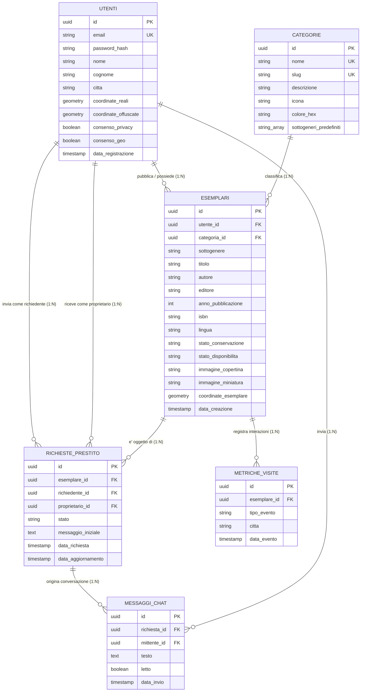

# Modello Concettuale Entità-Relazione (Modello E-R)

> **Corso di Studio:** Laurea Triennale in Informatica per le Aziende Digitali (L-31)  
> **Tema n. 4:** Sharing technologies | **Traccia PW n. 14:** Sviluppo di un software di geolocalizzazione culturale per condividere il patrimonio librario degli utenti privati  
> **Progetto:** Hermae — Candidato: Nunzio Giglio (Matr. 0312200894)  
> **Cartella di Riferimento:** `INFO-DATABASE/`  

---

## 1. Descrizione del Dominio e Scelte Concettuali

Il modello concettuale formalizza i requisiti informativi della piattaforma **Hermae**, focalizzata sul censimento, la geolocalizzazione confidenziale e il prestito peer-to-peer del patrimonio librario custodito da privati.

### 1.1 Entità Fondamentali del Sistema
1. **UTENTI:** Rappresenta i soggetti registrati alla piattaforma. Ciascun utente detiene un profilo personale, rilascia consensi obbligatori per la privacy (GDPR) e la geolocalizzazione, e possiede una coppia di coordinate (reali per i calcoli interni, offuscate per la visualizzazione pubblica).
2. **CATEGORIE:** Tassonomia gerarchica ibrida a due livelli (Livello 1: macro-aree disciplinari controllate con iconografia e codici colore; Livello 2: vocabolario guidato di sottogeneri Thema/BISAC semplificati).
3. **ESEMPLARI:** Rappresenta la **singola copia fisica materiale** posseduta e custodita da un utente privato (distinta dall'astrazione del "libro/opera", secondo lo standard catalografico **IFLA LRM / FRBR**). L'esemplare è caratterizzato da metadati editoriali, stato di usura materiale, foto reale della copertina in formato WebP, disponibilità e collocazione territoriale con raggio di confidenzialità.
4. **RICHIESTE_PRESTITO:** Modella l'interazione transazionale peer-to-peer per l'accesso a un determinato esemplare, gestita tramite una macchina a stati (*In attesa*, *Accettata*, *Rifiutata*, *Conclusa*).
5. **MESSAGGI_CHAT:** Scambio asincrono di messaggi testuali tra richiedente e proprietario, vincolato a una specifica richiesta di prestito per definire privatamente i dettagli dello scambio fisico.
6. **METRICHE_VISITE:** Tracciamento analitico anonimizzato delle interazioni sugli esemplari (consultazioni scheda, ricerche su mappa, prestiti) a supporto del monitoraggio dell'impatto culturale.

### 1.2 Identificatori Univoci Globali (UUID)
Tutte le entità adottano chiavi primarie di tipo **UUID (v4)** generate crittograficamente (`gen_random_uuid()`), precludendo l'enumerazione sequenziale (vulnerabilità IDOR), garantendo la riservatezza sui volumi del database e abilitando la generazione distribuita.

---

## 2. Diagramma Entità-Relazione (Mermaid E-R)

---

## 3. Analisi delle Relazioni e Cardinalità

| Relazione | Entità Coinvolte | Cardinalità | Descrizione Semantica e Regole di Dominio |
| :--- | :--- | :---: | :--- |
| **Possesso Esemplare** | `UTENTI` $\rightarrow$ `ESEMPLARI` | **1 : N** | Un utente può possedere e pubblicare zero, uno o più esemplari. Ciascun esemplare appartiene obbligatoriamente a un solo utente proprietario. |
| **Classificazione** | `CATEGORIE` $\rightarrow$ `ESEMPLARI` | **1 : N** | Una categoria include zero, uno o molti esemplari. Ciascun esemplare deve essere associato a esattamente una categoria tematica. |
| **Richiesta Richiedente** | `UTENTI` $\rightarrow$ `RICHIESTE_PRESTITO` | **1 : N** | Un utente può avanzare zero, una o più richieste di prestito nel tempo. |
| **Ricezione Proprietario** | `UTENTI` $\rightarrow$ `RICHIESTE_PRESTITO` | **1 : N** | Un proprietario può ricevere zero, una o più richieste di prestito per i propri esemplari. |
| **Oggetto del Prestito** | `ESEMPLARI` $\rightarrow$ `RICHIESTE_PRESTITO` | **1 : N** | Un esemplare può essere oggetto di più richieste di prestito storiche (una sola attiva per volta se lo stato è *In prestito*). |
| **Thread di Chat** | `RICHIESTE_PRESTITO` $\rightarrow$ `MESSAGGI_CHAT` | **1 : N** | Ciascuna richiesta di prestito origina una conversazione composta da zero o più messaggi testuali scambiati tra le due parti. |
| **Mittente Messaggio** | `UTENTI` $\rightarrow$ `MESSAGGI_CHAT` | **1 : N** | Un utente può inviare molteplici messaggi di chat all'interno dei thread a cui partecipa. |
| **Tracciamento Metriche** | `ESEMPLARI` $\rightarrow$ `METRICHE_VISITE` | **1 : N** | Ciascun esemplare colleziona zero, uno o molti record statistici anonimizzati (es. visualizzazioni della scheda o ricerche). |

---

## 4. Vincoli di Integrità Semantica e di Dominio

1. **Integrità Utente:** L'indirizzo `email` è univoco globale. La password è memorizzata unicamente in forma crittografata irreversibile (`bcrypt` con salt $\ge 12$).
2. **Privacy delle Coordinate:** L'entità `UTENTI` distingue concettualmente `coordinate_reali` (riservate, usate solo dal motore di calcolo distanze) da `coordinate_offuscate` (punto pubblico con raggio di confidenzialità di 300–500 m).
3. **Coerenza Geografica dell'Esemplare:** L'attributo `coordinate_esemplare` nell'entità `ESEMPLARI` eredita la posizione confidenziale del proprietario, tutelando il domicilio.
4. **Ciclo di Vita del Prestito:** Il vincolo di stato su `RICHIESTE_PRESTITO` ammette solo i valori dell'enumerazione: `IN_ATTESA`, `ACCETTATA`, `RIFIUTATA`, `CONCLUSA`. Se una richiesta passa ad `ACCETTATA`, lo `stato_disponibilita` dell'esemplare transita automaticamente su `IN_PRESTITO`.
