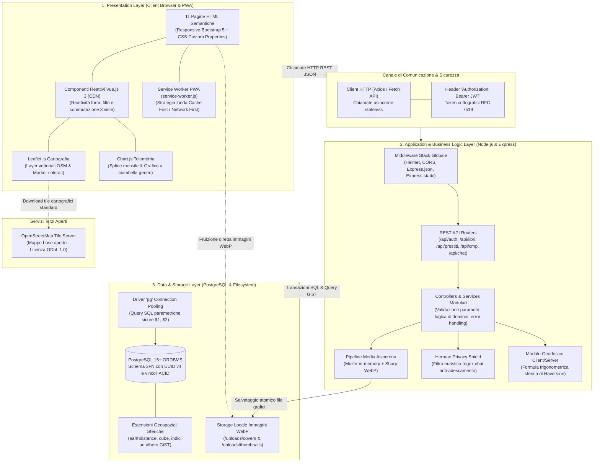

# Diagramma dell'Architettura Software a Livelli (Layered Architecture)

> **Progetto:** Hermae — *"Il sapere, un libro alla volta"*  
> **Candidato:** Nunzio Giglio (Matricola: 0312200894)  
> **Corso di Laurea:** Informatica per le Aziende Digitali (L-31) — Università Telematica Pegaso  
> **Tema n. 4:** Sharing technologies | **Traccia PW n. 14**  
> **Collocazione:** Cartella `MULTIMEDIA/` — Documentazione Tecnica e Tesi  

---

## 1. Descrizione Architetturale

L'applicazione **Hermae** implementa un'architettura **Client-Server disaccoppiata a tre livelli (Three-Tier Layered Architecture)** conforme ai principi REST (*Representational State Transfer*). Il sistema disaccoppia nettamente la logica di presentazione, l'elaborazione di business e la persistenza relazionale, garantendo modularità, sicurezza e scalabilità orizzontale.

---

## 2. Diagramma Architetturale Generale (Mermaid)

---

## 3. Dettaglio dei Livelli Software

### 1. Presentation Layer (Front-End)
- **Architettura Multi-Pagina (11 Viste):** Scelta per preservare la navigabilità nativa del browser (cronologia, tasti avanti/indietro, bookmarking), evitando la complessità e la fragilità delle Single Page Application monolitiche.
- **Vue.js 3 in modalità CDN Progressiva:** Integrato direttamente nelle pagine per gestire lo stato reattivo locale (filtri istantanei, form dinamici, commutazione tra Tabella, Card e Scaffale 3D) con First Contentful Paint inferiore a 1 secondo.
- **Service Worker PWA:** Gestisce la cache offline tramite la Cache Storage API con strategia Network First per dati dinamici e Cache First per asset statici.

### 2. Business Logic Layer (Back-End)
- **Runtime Node.js & Framework Express.js:** Esecuzione asincrona event-driven non bloccante.
- **Autenticazione Stateless:** Autenticazione basata su JSON Web Token (JWT) firmati con algoritmo HMAC-SHA256 e conservazione password con salting adattivo bcrypt a 10 cicli.
- **Hermae Privacy Shield:** Middleware per la sanitizzazione del testo nelle chat private con mascheramento di email e numeri telefonici.

### 3. Data & Persistence Layer (Database & Storage)
- **PostgreSQL 15+:** Database relazionale conforme allo standard ACID, con schema in 3FN e identificatori primari `UUID v4`.
- **Indici GiST su `ll_to_earth()`:** Calcolo geodetico su coordinate sferiche con risposte costantemente sotto i 2 millisecondi.
- **Storage WebP:** File system locale strutturato per archiviare separatamente copertine di dettaglio (800x1200 px) e miniature (200x300 px), con cancellazione atomica dei file orfani.
