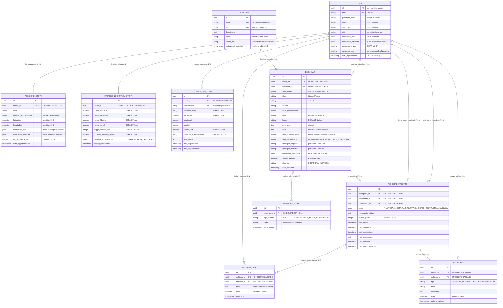

# Diagramma Entità-Relazione (Schema E-R Concettuale e Logico 3FN)

> **Progetto:** Hermae — *"Il sapere, un libro alla volta"*  
> **Candidato:** Nunzio Giglio (Matricola: 0312200894)  
> **Corso di Laurea:** Informatica per le Aziende Digitali (L-31) — Università Telematica Pegaso  
> **Tema n. 4:** Sharing technologies | **Traccia PW n. 14**  
> **Collocazione:** Cartella `MULTIMEDIA/` — Documentazione Tecnica e Tesi  

---

## 1. Descrizione del Modello dei Dati

La persistenza di **Hermae** poggia su un database relazionale avanzato (**PostgreSQL 15+**) strutturato secondo la **Terza Forma Normale (3FN)** per eliminare le anomalie di inserimento, modifica e cancellazione. Il modello dati è concepito per soddisfare tre pilastri architetturali:

1. **Standard Catalografico IFLA LRM / FRBR:** Netta distinzione concettuale tra *Categoria/Opera* ed *Esemplare fisico* (`ESEMPLARI`), inteso come singola copia materiale detenuta da un cittadino, caratterizzata da usura, note bibliografiche, collocazione geospaziale e storico transazionale.
2. **Privacy by Design e Sovranità del Dato:** Scorporo dell'utente nelle entità correlate 1:1 `POSIZIONE_UTENTI` e `PREFERENZE_PRIVACY_UTENTI`, con gestione del registro audit del consenso conforme a GDPR ed ePrivacy (`CONSENSI_CMP_UTENTI`).
3. **Identificatori Crittografici Globali (UUID v4):** Tutte le tabelle adottano chiavi primarie `UUID v4` generate crittograficamente (`gen_random_uuid()`), precludendo attacchi di enumerazione sequenziale (IDOR).

---

## 2. Diagramma Entità-Relazione Completo (Mermaid)

---

## 3. Dettaglio delle Relazioni e Vincoli di Integrità

### Cardinalità delle Relazioni
| Relazione | Entità Coinvolte | Cardinalità | Regola di Integrità Referenziale |
| :--- | :--- | :---: | :--- |
| **Localizzazione Utente** | `UTENTI` $\leftrightarrow$ `POSIZIONE_UTENTI` | **1 : 1** | Ciascun utente ha esattamente una configurazione territoriale. `ON DELETE CASCADE`. |
| **Privacy Utente** | `UTENTI` $\leftrightarrow$ `PREFERENZE_PRIVACY_UTENTI` | **1 : 1** | Impostazioni di riservatezza strettamente vincolate al profilo. `ON DELETE CASCADE`. |
| **Audit Consensi CMP** | `UTENTI` $\rightarrow$ `CONSENSI_CMP_UTENTI` | **1 : N** | Storico dei consensi cookie ed ePrivacy con timestamp di espressione e revisione. |
| **Possesso Esemplari** | `UTENTI` $\rightarrow$ `ESEMPLARI` | **1 : N** | Un utente può catalogare molteplici libri fisici; ogni copia appartiene a un unico custode. |
| **Classificazione** | `CATEGORIE` $\rightarrow$ `ESEMPLARI` | **1 : N** | Ciascun esemplare appartiene a una sola macro-categoria. Vincolo `ON DELETE RESTRICT`. |
| **Richiesta Prestito** | `UTENTI` / `ESEMPLARI` $\rightarrow$ `RICHIESTE_PRESTITO` | **1 : N** | Coinvolge richiedente, proprietario ed esemplare. Gestita a transazioni atomiche. |
| **Messaggistica Privata** | `RICHIESTE_PRESTITO` $\rightarrow$ `MESSAGGI_CHAT` | **1 : N** | Ogni richiesta attiva un canale di chat bidirezionale confidenziale. |
| **Sistema Notifiche** | `UTENTI` $\rightarrow$ `NOTIFICHE` | **1 : N** | Segnalazioni asincrone di cambi di stato o nuovi messaggi ricevuti. |
| **Telemetria Culturale** | `ESEMPLARI` $\rightarrow$ `METRICHE_VISITE` | **1 : N** | Rilevamento analitico anonimizzato delle consultazioni. Vincolo `ON DELETE SET NULL`. |

### Indici Geospaziali e Prestazionali
1. **Indici GiST (Generalized Search Tree):** Definiti sulle colonne `coordinate_esemplare`, `coordinate_offuscate` e tramite estensione `earthdistance` (`cube`), riducendo la complessità di ricerca da $\mathcal{O}(N)$ a $\mathcal{O}(\log N)$.
2. **Indici B-Tree Composti:** Applicati sulle chiavi esterne ad alta frequenza di join, in particolare su `(esemplare_id, stato)` e `(proprietario_id, stato)` in `RICHIESTE_PRESTITO`, garantendo latenze inferiori a 2 ms anche su milioni di tuple.
