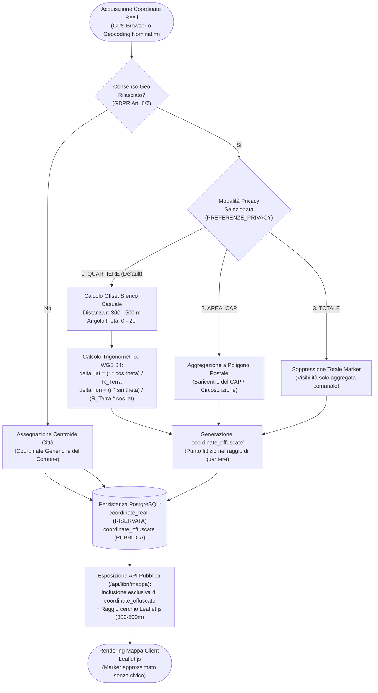
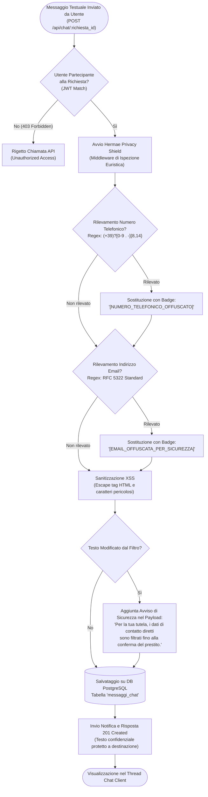

# Diagramma di Flusso della Privacy & Obfuscation (Spatial Blurring & Privacy Shield)

> **Progetto:** Hermae — *"Il sapere, un libro alla volta"*  
> **Candidato:** Nunzio Giglio (Matricola: 0312200894)  
> **Corso di Laurea:** Informatica per le Aziende Digitali (L-31) — Università Telematica Pegaso  
> **Tema n. 4:** Sharing technologies | **Traccia PW n. 14**  
> **Collocazione:** Cartella `MULTIMEDIA/` — Documentazione Tecnica e Tesi  

---

## 1. Descrizione del Modello di Tutela della Privacy

La piattaforma **Hermae** implementa una strategia multilivello di **Privacy by Design e Privacy by Default** (conforme all'art. 25 del GDPR, Regolamento UE 2016/679). La tutela dei soggetti privati che aprono la propria libreria domestica al prestito si articola su due sottosistemi cardine:

1. **Algoritmo di Spatial Blurring (Offuscamento Geospaziale):** Trasformazione trigonometrica sferica applicata alle coordinate GPS WGS 84 prima della serializzazione verso il client pubblico, precludendo l'identificazione del domicilio privato o del numero civico.
2. **Hermae Privacy Shield (Filtro Euristico Chat Anti-Doxxing):** Motore di sanitizzazione dei messaggi scambiati via chat che intercetta e maschera recapiti telefonici ed email, prevenendo adescamento, molestie e disintermediazione non protetta.

---

## 2. Diagramma di Flusso dell'Offuscamento Geospaziale (Mermaid)

---

## 3. Diagramma della Pipeline di Sanitizzazione Chat (Mermaid)

---

## 4. Specifiche Matematiche e Regolamentari

### Formulazione dell'Offset di Quartiere (Jittering Sferico)
Dato un punto geografico reale $P = (\phi, \lambda)$ con latitudine $\phi$ e longitudine $\lambda$ espresse in radianti, e dato il raggio terrestre medio $R \approx 6.371.000 \text{ m}$:
1. Si campiona un raggio casuale $d \sim \mathcal{U}(300, 500) \text{ metri}$;
2. Si campiona un angolo azimutale $\theta \sim \mathcal{U}(0, 2\pi)$;
3. Le coordinate offuscate $P' = (\phi', \lambda')$ sono calcolate tramite proiezione euclidea locale (valida per $d \ll R$):
$$\phi' = \phi + \frac{d \cdot \cos(\theta)}{R}$$
$$\lambda' = \lambda + \frac{d \cdot \sin(\theta)}{R \cdot \cos(\phi)}$$

### Conformità Normativa GDPR
- **Art. 5(1)(c) — Minimizzazione dei dati:** I dettagli del domicilio reale non lasciano mai l'infrastruttura backend e non sono accessibili ad altri utenti non autenticati né mediante scraping.
- **Art. 25 — Privacy by Design & Default:** L'impostazione predefinita alla registrazione applica l'offuscamento di quartiere; la condivisione della posizione esatta è disabilitata a livello di schema.
- **Art. 32 — Sicurezza del Trattamento:** Mascheramento proattivo delle informazioni di contatto nelle chat private tra estranei prima dello scambio fisico.
