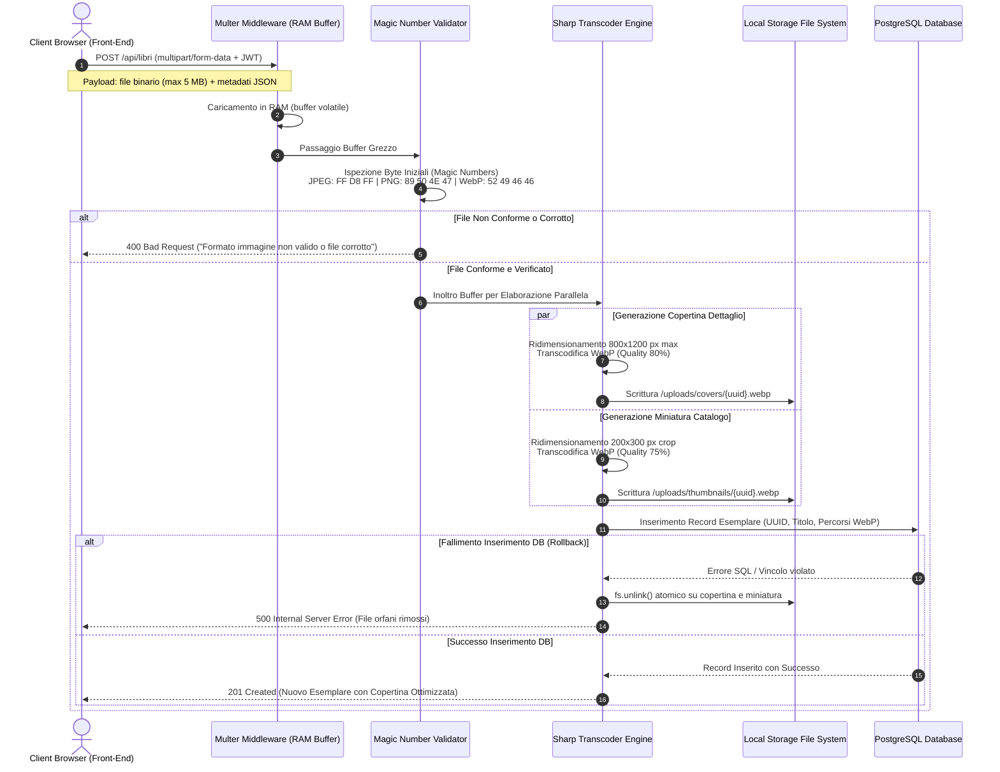
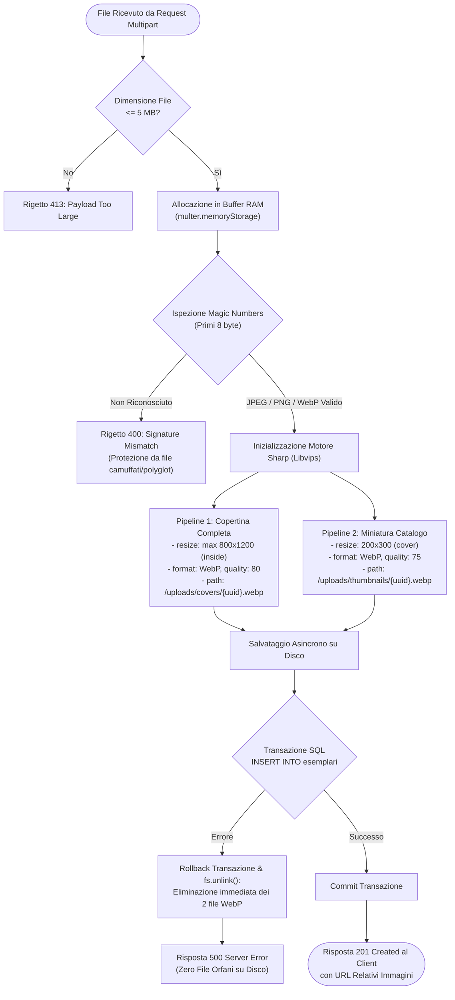

# Diagramma della Pipeline di Elaborazione Immagini (Multer & Sharp WebP)

> **Progetto:** Hermae — *"Il sapere, un libro alla volta"*  
> **Candidato:** Nunzio Giglio (Matricola: 0312200894)  
> **Corso di Laurea:** Informatica per le Aziende Digitali (L-31) — Università Telematica Pegaso  
> **Tema n. 4:** Sharing technologies | **Traccia PW n. 14**  
> **Collocazione:** Cartella `MULTIMEDIA/` — Documentazione Tecnica e Tesi  

---

## 1. Descrizione della Pipeline Multimediale

La gestione delle immagini fotografiche delle copertine in **Hermae** è progettata secondo rigorosi standard di **sicurezza applicativa**, **efficienza di banda** e **ottimizzazione dell'esperienza utente (Core Web Vitals - LCP)**.

### Principi Ingegneristici Adottati
1. **Acquisizione in Memoria Volatile (`MemoryStorage`):** Il file binario non viene mai scritto direttamente sul file system all'atto della ricezione, precludendo l'esecuzione di file dannosi o script malevoli non verificati.
2. **Validazione Crittografica dei Magic Numbers:** L'applicazione non si fida dell'estensione fornita dall'utente o dell'header `Content-Type`, ma ispeziona i primi byte (*file signatures*) del buffer binario.
3. **Transcodifica Asincrona Standardizzata (Formato WebP):** Tramite la libreria a prestazioni native in C++ `sharp`, qualsiasi immagine valida viene convertita in formato **Google WebP**, generando contestualmente due risoluzioni distinte:
   - **Copertina di Dettaglio:** Risoluzione massima $800 \times 1200 \text{ px}$ (qualità 80%, compressione predittiva), destinata alla scheda libro;
   - **Miniatura Catalogo:** Risoluzione ridotta $200 \times 300 \text{ px}$ (qualità 75%, ritaglio esatto), destinata a catalogo, scaffale 3D e popup cartografici (riduzione peso $> 85\%$).
4. **Cancellazione Atomica dei File Orfani:** In caso di errore durante la transazione sul database PostgreSQL, un blocco di rollback rimuove immediatamente i file WebP generati sul disco, prevenendo il degrado dello spazio di archiviazione.

---

## 2. Diagramma di Sequenza della Pipeline (Mermaid sequenceDiagram)

---

## 3. Diagramma di Flusso della Validazione e Transcodifica (Mermaid)

---

## 4. Analisi Comparativa delle Prestazioni e Metriche

| Parametro | Immagine Originale (Upload Tipico) | Copertina Dettaglio WebP | Miniatura WebP Catalogo | Guadagno Prestazionale |
| :--- | :---: | :---: | :---: | :---: |
| **Formato** | JPEG / PNG da fotocamera | WebP Lossy | WebP Lossy | Formato next-gen W3C |
| **Risoluzione Tipica** | $4032 \times 3024 \text{ px}$ | $800 \times 1200 \text{ px}$ (adattivo) | $200 \times 300 \text{ px}$ | Riduzione pixel $> 95\%$ |
| **Peso Medio File** | $\sim 3.8 \text{ MB}$ | $\sim 140 \text{ KB}$ | $\sim 18 \text{ KB}$ | **Compressione del 99.5%** |
| **Impatto Core Web Vitals** | LCP $> 4.2 \text{ s}$ (Bloccante) | LCP $< 0.8 \text{ s}$ | Caricamento istantaneo | **Ottimizzazione CWV (Good)** |
