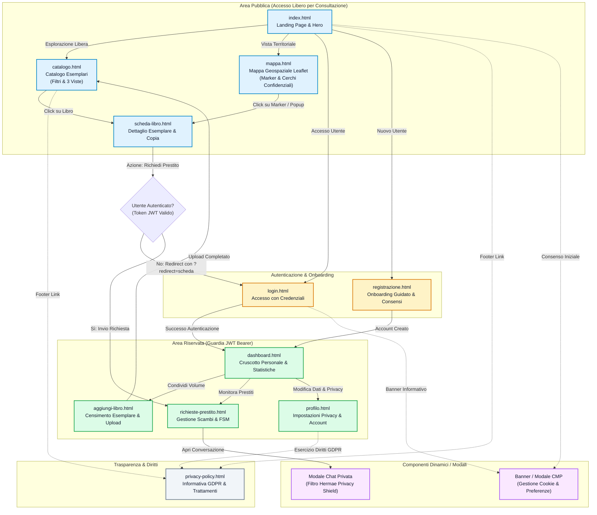

# Diagramma della Sitemap e Flusso di Navigazione Utente

> **Progetto:** Hermae — *"Il sapere, un libro alla volta"*  
> **Candidato:** Nunzio Giglio (Matricola: 0312200894)  
> **Corso di Laurea:** Informatica per le Aziende Digitali (L-31) — Università Telematica Pegaso  
> **Tema n. 4:** Sharing technologies | **Traccia PW n. 14**  
> **Collocazione:** Cartella `MULTIMEDIA/` — Documentazione Tecnica e Tesi  

---

## 1. Descrizione dell'Architettura Informativa e di Navigazione

L'interfaccia utente di **Hermae** è strutturata su **11 pagine HTML semantiche**, organizzate secondo una netta separazione tra **Area Pubblica** (ad accesso libero senza autenticazione, conforme ai principi di indicizzazione e consultazione culturale diffusa) e **Area Riservata Protetta** (accessibile unicamente previa verifica del token JWT memorizzato in `localStorage`).

La navigazione è arricchita da:
- **Guardie di Autenticazione Client-Side:** Intercettano i tentativi di accesso alle viste protette, reindirizzando l'utente al form di login con parametro di ritorno (`?redirect=...`).
- **Banner CMP (Consent Management Platform):** Interazione trasversale presente su tutte le pagine fino all'espressione della volontà dell'utente.
- **Pannelli Modali Dinamici:** Chat integrata in `richieste-prestito.html`, visualizzatore 3D nel catalogo, e modale di configurazione consensi.

---

## 2. Diagramma della Sitemap e Flusso di Navigazione (Mermaid)

---

## 3. Matrice delle 11 Viste del Sistema

| ID Vista | Nome File | Categoria di Accesso | Tecnologie Client | Ruolo Funzionale |
| :---: | :--- | :---: | :--- | :--- |
| **01** | `index.html` | Pubblica | HTML5, Bootstrap 5, CSS Vars | Presentazione piattaforma, statistiche della community, value proposition. |
| **02** | `catalogo.html` | Pubblica | Vue.js 3 (CDN), Axios | Ricerca avanzata full-text, filtri per genere/lingua, switch Tabella / Card / Scaffale 3D. |
| **03** | `mappa.html` | Pubblica | Leaflet.js, OpenStreetMap | Visualizzazione territoriale con cerchi confidenziali di quartiere (300-500 m). |
| **04** | `scheda-libro.html` | Pubblica | Vue.js 3, Leaflet.js | Metadati bibliografici IFLA LRM, foto reale in WebP, stato di conservazione e CTA prestito. |
| **05** | `login.html` | Ospite | Vanilla JS, Fetch API | Validazione form client-side, autenticazione JWT, salvataggio token in `localStorage`. |
| **06** | `registrazione.html` | Ospite | Vanilla JS, Geolocation API | Registrazione dati anagrafici, acquisizione consensi GDPR espliciti, coordinate di quartiere. |
| **07** | `dashboard.html` | Riservata (JWT) | Vue.js 3, Chart.js | Riepilogo volumi custoditi, prestiti in corso, andamento temporale delle consultazioni. |
| **08** | `aggiungi-libro.html` | Riservata (JWT) | Drag-and-Drop API, Fetch | Upload multipart/form-data copertina, associazione categoria a due livelli, note di usura. |
| **09** | `richieste-prestito.html`| Riservata (JWT) | Vue.js 3, Polling/Socket | Avanzamento macchina a stati (Accetta, Rifiuta, Restituisci), chat protetta integrata. |
| **10** | `profilo.html` | Riservata (JWT) | Vanilla JS, Fetch | Configurazione della modalità di offuscamento (Quartiere, CAP, Totale), cambio password. |
| **11** | `privacy-policy.html` | Pubblica / Legale | HTML5 Semantico, CMP | Informativa estesa ex artt. 13-14 GDPR, registro delle finalità e interfaccia revoca consensi. |
