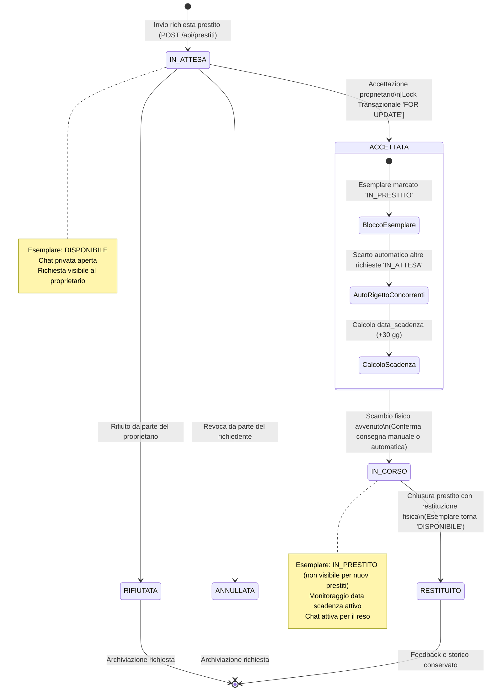
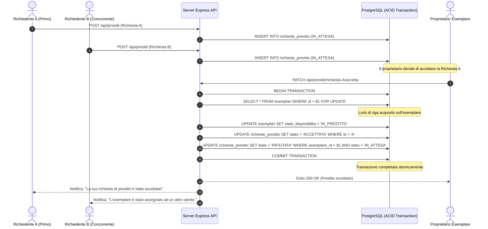

# Diagramma della Macchina a Stati del Prestito e Transazioni ACID

> **Progetto:** Hermae — *"Il sapere, un libro alla volta"*  
> **Candidato:** Nunzio Giglio (Matricola: 0312200894)  
> **Corso di Laurea:** Informatica per le Aziende Digitali (L-31) — Università Telematica Pegaso  
> **Tema n. 4:** Sharing technologies | **Traccia PW n. 14**  
> **Collocazione:** Cartella `MULTIMEDIA/` — Documentazione Tecnica e Tesi  

---

## 1. Descrizione del Ciclo di Vita del Prestito

La gestione del prestito tra utenti privati in **Hermae** è formalizzata come una **macchina a stati finiti (FSM - Finite State Machine)** implementata all'interno di transazioni relazionali **ACID** (*Atomicity, Consistency, Isolation, Durability*) gestite da PostgreSQL.

### Risoluzione della Concorrenza e Locking Pessimistico
Per prevenire anomalie di concorrenza del tipo *Race Condition* o *Double Booking* (assegnazione contemporanea dello stesso esemplare fisico a due richiedenti diversi), il server esegue l'accettazione all'interno di una transazione serializzata con clausola:
```sql
SELECT id, stato_disponibilita FROM esemplari WHERE id = $1 FOR UPDATE;
```
Tale lock pessimistico garantisce che, all'atto dell'accettazione di una richiesta:
1. Lo stato dell'esemplare transiti atomicamente a `IN_PRESTITO`.
2. Tutte le richieste concorrenti rimaste in stato `IN_ATTESA` per il medesimo esemplare vengano contestualmente e automaticamente rigettate dal motore con notifica ai richiedenti concorrenti.

---

## 2. Diagramma a Stati Finiti (Mermaid stateDiagram-v2)



---

## 3. Matrice delle Transizioni di Stato

| Stato Sorgente | Evento / Azione | Condizione di Guardia | Stato Destinazione | Effetto Collaterale su Esemplare |
| :--- | :--- | :--- | :--- | :--- |
| **Non Esistente** | `POST /api/prestiti` | Utente autenticato $\ne$ Proprietario | `IN_ATTESA` | Nessuno (`stato_disponibilita = DISPONIBILE`). Genera notifica. |
| `IN_ATTESA` | `PATCH /:id/rifiuta` | Eseguito dal proprietario | `RIFIUTATA` | Nessuno (`DISPONIBILE`). Notifica al richiedente. |
| `IN_ATTESA` | `PATCH /:id/annulla` | Eseguito dal richiedente | `ANNULLATA` | Nessuno (`DISPONIBILE`). Notifica al proprietario. |
| `IN_ATTESA` | `PATCH /:id/accetta` | Esemplare ancora `DISPONIBILE` (Lock `FOR UPDATE`) | `ACCETTATA` | `stato_disponibilita = IN_PRESTITO`. Auto-rifiuto richieste concorrenti. |
| `ACCETTATA` | `PATCH /:id/avvia` | Consegna materiale concordata via chat | `IN_CORSO` | Permane `IN_PRESTITO`. Inizio decorrenza giorni prestito. |
| `IN_CORSO` | `PATCH /:id/restituisci` | Restituzione verificata dal proprietario | `RESTITUITO` | `stato_disponibilita = DISPONIBILE`. Chiusura thread chat. |

---

## 4. Diagramma di Sequenza della Risoluzione Concorrente (Mermaid)


