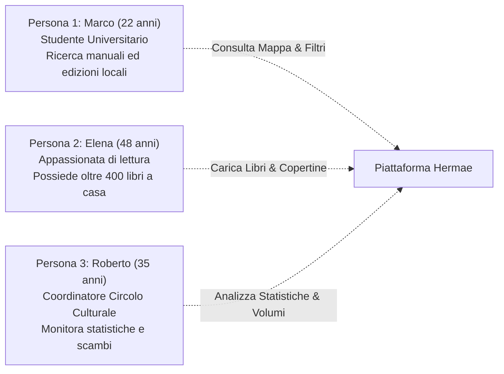
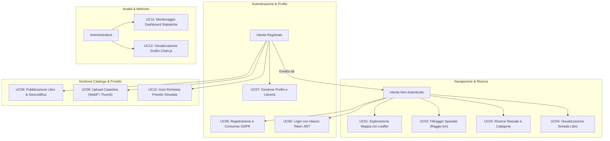
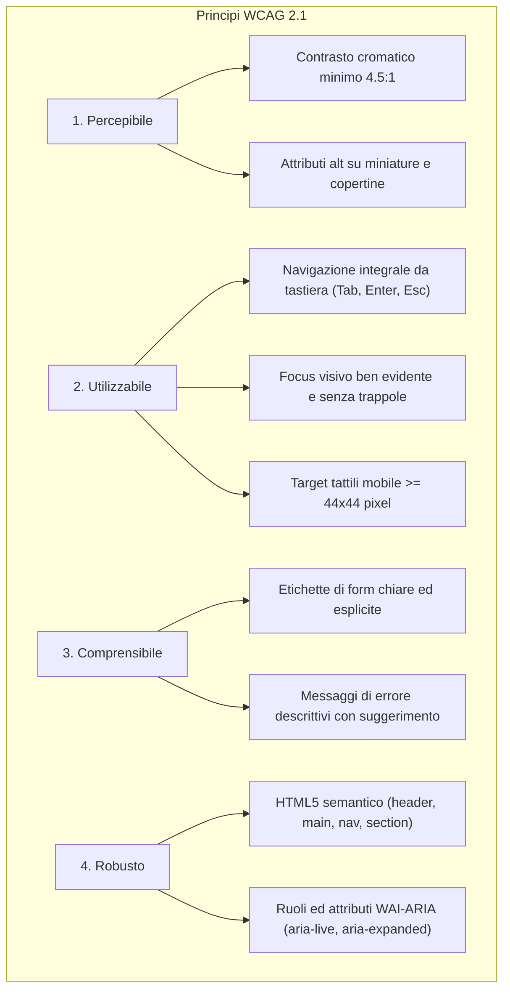
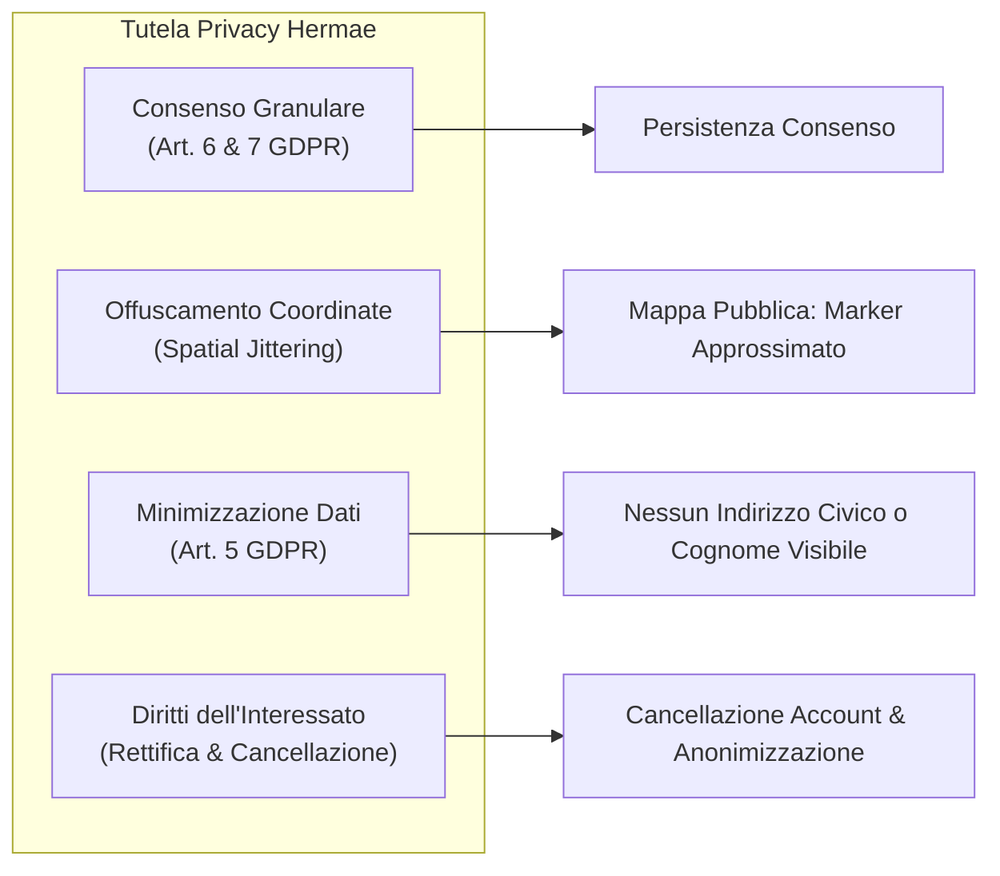

# Project Work "Hermae" — WP 1.1: Analisi dei Requisiti e Studio di Fattibilità

> **Candidato:** Nunzio Giglio (Matricola: 0312200894)  
> **Corso di Laurea:** Laurea Triennale in Informatica per le Aziende Digitali (L-31)  
> **Settori Scientifici Disciplinari:** Informatica (INF/01), Sistemi di elaborazione delle informazioni (ING-INF/05)  
> **Tema n. 4:** Sharing Technologies  
> **Traccia del PW n. 14:** Sviluppo di un software di geolocalizzazione culturale per condividere il patrimonio librario degli utenti privati  
> **Deliverable:** WP 1.1.1 — WP 1.1.2 — WP 1.1.3 (Documento Unificato di Analisi e Specifiche)  

---

## Indice del Documento
1. [Inquadramento del Work Package 1.1](#inquadramento-del-work-package-11)
2. [WP 1.1.1 — Analisi del Contesto Operativo e Modello di Sharing Librario Culturale](#wp-111--analisi-del-contesto-operativo-e-modello-di-sharing-librario-culturale)
   - 2.1 [Il problema della dispersione del patrimonio librario privato](#21-il-problema-della-dispersione-del-patrimonio-librario-privato)
   - 2.2 [Benchmarking e analisi dello stato dell'arte](#22-benchmarking-e-analisi-dello-stato-dellarte)
   - 2.3 [Definizione dell'ambito operativo territoriale e target](#23-definizione-dellambito-operativo-territoriale-e-target)
   - 2.4 [Profili utente e scenari d'uso (User Personas)](#24-profili-utente-e-scenari-duso-user-personas)
3. [WP 1.1.2 — Specifiche Dettagliate dei Requisiti Funzionali](#wp-112--specifiche-dettagliate-dei-requisiti-funzionali)
   - 3.1 [Identificazione degli Attori del Sistema](#31-identificazione-degli-attori-del-sistema)
   - 3.2 [Diagramma dei Casi d'Uso (Use Case Diagram)](#32-diagramma-dei-casi-duso-use-case-diagram)
   - 3.3 [Descrizione analitica dei Casi d'Uso](#33-descrizione-analitica-dei-casi-duso)
   - 3.4 [Matrice di Tracciabilità e Prioritizzazione MoSCoW](#34-matrice-di-tracciabilit%C3%A0-e-prioritizzazione-moscow)
4. [WP 1.1.3 — Specifiche Dettagliate dei Requisiti Non Funzionali](#wp-113--specifiche-dettagliate-dei-requisiti-non-funzionali)
   - 4.1 [Usabilità ed Accessibilità (WCAG 2.1 / WAI-ARIA)](#41-usabilit%C3%A0-ed-accessibilit%C3%A0-wcag-21--wai-aria)
   - 4.2 [Privacy, Tutela dei Dati e Consenso (GDPR / UE 2016/679)](#42-privacy-tutela-dei-dati-e-consenso-gdpr--ue-2016679)
   - 4.3 [Efficienza, Prestazioni e Scalabilità Spaziale](#43-efficienza-prestazioni-e-scalabilit%C3%A0-spaziale)
   - 4.4 [Sicurezza Applicativa e Integrità dei Dati](#44-sicurezza-applicativa-e-integrit%C3%A0-dei-dati)
   - 4.5 [Manutenibilità, Portabilità e Vincoli Architetturali](#45-manutenibilit%C3%A0-portabilit%C3%A0-e-vincoli-architetturali)
5. [Conclusioni e Transizione al WP 1.2](#conclusioni-e-transizione-al-wp-12)

---

## 1. Inquadramento del Work Package 1.1

Il Work Package 1.1 costituisce la fase fondativa del progetto **Hermae**, focalizzata sull'indagine conoscitiva del dominio applicativo, sulla formalizzazione delle esigenze dell'utenza e sulla rigorosa traduzione di tali necessità in specifiche funzionali e vincoli ingegneristici non funzionali.

L'output del WP 1.1 consolida le tre sotto-fasi previste dalla Work Breakdown Structure:
- **WP 1.1.1:** Analisi del contesto operativo e definizione del modello di sharing librario;
- **WP 1.1.2:** Capitolato dettagliato dei requisiti funzionali e casi d'uso;
- **WP 1.1.3:** Capitolato dei requisiti non funzionali (usabilità WCAG 2.1, privacy GDPR, sicurezza e prestazioni GIS).

---

## 2. WP 1.1.1 — Analisi del Contesto Operativo e Modello di Sharing Librario Culturale

### 2.1 Il problema della dispersione del patrimonio librario privato

Nelle moderne realtà urbane e suburbane, una quota preponderante del patrimonio bibliografico e documentario risiede all'interno di collezioni private: biblioteche domestiche, archivi personali, raccolte tematiche universitarie e cataloghi amatoriali. Tale ricchezza culturale rimane tuttavia inaccessibile alla collettività a causa di molteplici fattori strutturali:

1. **Assenza di visibilità digitale:** I volumi privati non sono censiti in alcun catalogo pubblico né indicizzati sui motori di ricerca convenzionali.
2. **Asimmetria informativa di prossimità:** Spesso lettori residenti nello stesso quartiere, complesso residenziale o polo universitario ricercano testi rari, manuali di studio o narrativa fuori catalogo che si trovano fisicamente a poche centinaia di metri di distanza, ma l'assenza di un canale informativo condiviso rende impossibile l'incontro tra domanda e offerta.
3. **Barriere all'accesso del prestito pubblico:** Le biblioteche civiche e statali presentano orari di apertura vincolanti, procedure formali di iscrizione e spesso tempi lunghi di reperimento, oltre a non poter coprire l'intera varietà di edizioni speciali o testi settoriali posseduti dai privati.

> [!NOTE]
> Il progetto **Hermae** (dal nome delle erme greche, tradizionali cippi viari e protettori dei crocevia e della trasmissione del sapere) nasce per risolvere tale frammentazione tramite l'applicazione di paradigmi di **geolocalizzazione culturale** e **sharing economy non monetaria**, trasformando le collezioni private in una "biblioteca diffusa e di prossimità".

---

### 2.2 Benchmarking e analisi dello stato dell'arte

Per comprendere il posizionamento di Hermae, è stata condotta un'analisi comparativa delle piattaforme esistenti:

| Piattaforma | Modello Funzionale | Punti di Forza | Limiti e Gap Risolti da Hermae |
| :--- | :--- | :--- | :--- |
| **BookCrossing** | Rilascio di libri fisici in luoghi pubblici con etichetta ID (*BCID*). | Comunità globale storica, serendipità nel ritrovamento del volume. | Mancanza di un catalogo statico di prossimità; impossibilità di sapere dove reperire un libro con certezza; alto tasso di smarrimento dei volumi. |
| **Little Free Library** | Casette fisiche di legno per lo scambio di quartiere ("prendi un libro, lascia un libro"). | Forte radicamento di comunità, tangibilità immediata. | Assenza di un inventario digitale; impossibilità di interrogare il catalogo da remoto; nessun dato su disponibilità o categoria. |
| **Anobii / Goodreads** | Piattaforme di catalogazione e recensione social delle proprie letture. | Cataloghi enormi, algoritmi di raccomandazione sociale. | Assenza di funzionalità geospaziali di prossimità; non consentono la gestione del prestito locale né lo scambio peer-to-peer di quartiere. |
| **SBN / OPAC Nazionali** | Cataloghi collettivi delle biblioteche pubbliche e universitarie. | Rilevanza scientifica e rigore catalografico istituzionale. | Esclusione totale del patrimonio privato; formalismo burocratico e assenza di dinamiche partecipative dal basso. |

**Proposta di Valore di Hermae:**
Hermae unisce la rigorosa catalogazione digitale (con gestione di metadati, copertine e miniature ottimizzate in formato WebP) a un **motore geospaziale interattivo basato su Leaflet.js e PostGIS**, offrendo agli utenti una mappa dinamica con filtraggio per raggio chilometrico, senza intermediari commerciali e con meccanismi di simulazione del prestito a tutela della privacy dell'utente.

---

### 2.3 Definizione dell'ambito operativo territoriale e target

L'ambito operativo individuato è quello della **comunità territoriale di prossimità**:
- **Scala Urbana e di Quartiere:** Raggio d'azione tipico compreso tra 500 metri e 10-15 chilometri, percorribile a piedi, in bicicletta o con il trasporto pubblico locale.
- **Poli Universitari e Comunità Tematiche:** Raggruppamento di studenti e ricercatori per la condivisione di testi accademici e monografie specialistiche.
- **Circoli Culturali e Associazioni di Vicinato:** Condivisione di cataloghi tematici (es. storia locale, narrativa, saggistica).

---

### 2.4 Profili utente e scenari d'uso (User Personas)

Per guidare la progettazione centrata sull'utente (User-Centered Design), sono stati delineati tre archetipi di riferimento:

#### Persona 1: Marco, 22 anni — Lo Studente Fuorisede
- **Contesto:** Iscritto a un corso di laurea, dispone di un budget limitato e cerca dispense e libri di testo d'esame.
- **Obiettivo:** Aprire la mappa, impostare un raggio di 2 km dal proprio alloggio e trovare colleghi disposti a prestare manuali di informatica o matematica.
- **Frustrazioni attuali:** Costi elevati dei libri nuovi e biblioteche di facoltà con copie uniche costantemente in prestito.

#### Persona 2: Elena, 48 anni — La Curatrice Domestica
- **Contesto:** Possiede una biblioteca privata di oltre 400 volumi di narrativa e saggistica e desidera valorizzarla.
- **Obiettivo:** Catalogare rapidamente i propri libri dal computer di casa caricando una foto della copertina, mantenendo riservato l'indirizzo esatto dell'abitazione.
- **Frustrazioni attuali:** Dispiacere nel vedere volumi preziosi inutilizzati a prendere polvere sugli scaffali.

#### Persona 3: Roberto, 35 anni — Il Gestore di Rete Culturale
- **Contesto:** Anima un circolo di lettura di quartiere e organizza incontri culturali.
- **Obiettivo:** Esaminare la dashboard statistica per monitorare quali generi letterari sono più richiesti nella zona e favorire scambi tematici.

---

## 3. WP 1.1.2 — Specifiche Dettagliate dei Requisiti Funzionali

### 3.1 Identificazione degli Attori del Sistema

Il sistema riconosce tre categorie principali di utenti:
1. **Utente Non Autenticato (Ospite / Visitatore):** Può esplorare liberamente la mappa pubblica, visualizzare i libri georeferenziati entro un'area, effettuare ricerche testuali e consultare le schede libro.
2. **Utente Autenticato (Membro Registrato):** Dispone di tutte le funzionalità dell'ospite e può inoltre: pubblicare nuovi volumi, caricare copertine, gestire la propria libreria, richiedere prestiti simulati ad altri utenti e modificare il proprio profilo e consensi privacy.
3. **Amministratore (Admin):** Ha accesso alla dashboard di telemetria e aggregazione delle metriche d'uso (numero volumi pubblicati, prestiti richiesti, visualizzazioni per categoria e per raggio geografico).

---

### 3.2 Diagramma dei Casi d'Uso (Use Case Diagram)

---

### 3.3 Descrizione analitica dei Casi d'Uso

#### UC01 & UC02: Esplorazione Cartografica e Filtraggio Spaziale
- **Attore Primario:** Utente Visitatore / Utente Registrato.
- **Precondizioni:** Il client ha caricato la vista `/` e ha consentito l'accesso alla geolocalizzazione o ha selezionato un punto di riferimento sulla mappa.
- **Flusso Principale:**
  1. L'utente visualizza la mappa Leaflet.js centrata sulle proprie coordinate o su un default urbano.
  2. L'utente muove lo slider del raggio di ricerca (es. 1 km, 5 km, 10 km, 25 km).
  3. L'applicazione invia una richiesta GET parametrizzata al back-end (`/api/v1/libri/geo?lat=...&lng=...&radius=...`).
  4. Il back-end interroga PostgreSQL tramite la funzione `ST_DWithin` indicizzata con `GIST`.
  5. Il client riceve la collezione GeoJSON/JSON e renderizza i marker personalizzati sulla mappa.
- **Flusso Alternativo:** L'utente nega i permessi di localizzazione del browser: il sistema si posiziona automaticamente sul centro della città selezionata come fallback e mostra un alert non bloccante.

#### UC08 & UC09: Pubblicazione Libro e Pipeline Immagine
- **Attore Primario:** Utente Registrato.
- **Precondizioni:** Utente autenticato con JWT valido, rotta protetta `/pubblica`.
- **Flusso Principale:**
  1. L'utente inserisce i metadati del volume: Titolo, Autore, Anno di pubblicazione, Categoria/Genere letterario, Condizione del volume e note descrittive.
  2. L'utente specifica la posizione di condivisione del volume (tramite click su mappa o rilevamento coordinate).
  3. L'utente seleziona un file immagine (JPEG/PNG) da associare alla copertina.
  4. Il client mostra l'anteprima istantanea dell'immagine e convalida i campi prima dell'invio.
  5. Il form invia un payload `multipart/form-data` all'endpoint `/api/v1/libri`.
  6. Il back-end valida il token, memorizza l'immagine tramite Multer, esegue la trasformazione con `sharp` (generando versione standard WebP 800px e miniatura WebP 200px) e persiste il record su PostgreSQL con la coordinata `ST_SetSRID(ST_MakePoint(lng, lat), 4326)`.
- **Postcondizioni:** Il libro entra nel catalogo ed è immediatamente visibile sulla mappa pubblica.

#### UC10: Consultazione Dettaglio e Richiesta di Prestito Simulata
- **Attore Primario:** Utente Registrato.
- **Precondizioni:** L'utente ha selezionato un volume dalla mappa o dall'elenco (`/libri/:id`).
- **Flusso Principale:**
  1. L'utente visualizza la scheda completa con copertina WebP ad alta risoluzione, stato di disponibilità ("Disponibile", "In Prestito"), dettagli catalografici e una mini-mappa con raggio di confidenzialità.
  2. L'utente clicca su "Richiedi Prestito".
  3. Il sistema apre un modal di conferma in cui specificare un messaggio opzionale per il proprietario e la durata richiesta.
  4. Alla conferma, il back-end crea un record nella tabella `prestiti` con stato `IN_ATTESA` e aggiorna le metriche del libro (`richieste_count = richieste_count + 1`).
  5. Il sistema presenta all'utente un feedback visivo positivo e aggiorna il badge di stato.

#### UC11 & UC12: Dashboard Amministrativa e Statistiche
- **Attore Primario:** Utente Amministratore.
- **Precondizioni:** Token JWT con payload contenente il ruolo `admin`, rotta `/dashboard`.
- **Flusso Principale:**
  1. Il client interroga l'endpoint `/api/v1/statistiche/aggregate`.
  2. Il back-end esegue query aggregate SQL (conteggio totale volumi, utenti attivi, distribuzione per categoria, volumi con più richieste).
  3. La pagina visualizza schede KPI riassuntive e grafici interattivi Chart.js (grafico a barre per categorie, grafico a linee per l'andamento temporale dei prestiti).

---

### 3.4 Matrice di Tracciabilità e Prioritizzazione MoSCoW

Per garantire una gestione trasparente del ciclo di sviluppo, tutti i requisiti funzionali sono stati prioritizzati secondo la metodologia **MoSCoW** (*Must have*, *Should have*, *Could have*, *Won't have*):

| ID Req | Descrizione Requisito | Modulo Architetturale | Priorità | Attore Coinvolto |
| :---: | :--- | :--- | :---: | :--- |
| **FR-01** | Registrazione utente con validazione e consensi GDPR | Back-end Auth / Front-end View | **MUST** | Utente Ospite |
| **FR-02** | Login con rilascio token JWT e cifratura bcrypt | Back-end Security / Axios Interceptor | **MUST** | Utente Registrato |
| **FR-03** | Inserimento metadati libro (titolo, autore, anno, categoria) | Back-end Books / Front-end Form | **MUST** | Utente Registrato |
| **FR-04** | Upload immagine copertina con conversione WebP e thumbnail | Back-end Sharp / Multer Storage | **MUST** | Utente Registrato |
| **FR-05** | Persistenza coordinate geografiche con PostGIS (`Point 4326`) | Database PostgreSQL / PostGIS | **MUST** | Sistema |
| **FR-06** | Mappa interattiva Leaflet con rendering marker libri | Front-end GIS / Tile OpenStreetMap | **MUST** | Tutti gli utenti |
| **FR-07** | Ricerca spaziale per raggio chilometrico (`ST_DWithin`) | Back-end GIS / Front-end Slider | **MUST** | Tutti gli utenti |
| **FR-08** | Scheda dettaglio libro accessibile e link condivisibile | Front-end Router (`/libri/:id`) | **MUST** | Tutti gli utenti |
| **FR-09** | Simulazione richiesta prestito e aggiornamento stato | Back-end Loans / Front-end Modal | **MUST** | Utente Registrato |
| **FR-10** | Tracciamento visualizzazioni volumi e statistiche base | Back-end Telemetry / Database | **SHOULD** | Sistema |
| **FR-11** | Dashboard amministrativa con grafici analitici Chart.js | Front-end Admin / Chart.js | **SHOULD** | Amministratore |
| **FR-12** | Ricerca testuale full-text per titolo e autore | Back-end SQL / Front-end Search Bar | **SHOULD** | Tutti gli utenti |
| **FR-13** | Filtro combinato spaziale + categoria tematica | Back-end GIS / Front-end Filters | **SHOULD** | Tutti gli utenti |
| **FR-14** | Esportazione report statistico in formato CSV/JSON | Back-end Admin Service | **COULD** | Amministratore |
| **FR-15** | Chat in tempo reale tra proprietario e richiedente | WebSockets Engine | **WON'T** | Rimandato a release 2.0 |

---

## 4. WP 1.1.3 — Specifiche Dettagliate dei Requisiti Non Funzionali

### 4.1 Usabilità ed Accessibilità (WCAG 2.1 / WAI-ARIA)

In stretta ottemperanza ai principi fondanti del Corso di Laurea in Informatica per le Aziende Digitali e alle linee guida dell'Unione Europea in materia di inclusione digitale, Hermae è progettato sin dal principio secondo i criteri di **Universal Design**:

> [!IMPORTANT]
> Il target di accessibilità è il livello **AA delle Web Content Accessibility Guidelines (WCAG) 2.1**, come recepito dallo standard europeo **EN 301 549**.

#### Specifiche Operative di Accessibilità:
1. **Contrasto Cromatico:** Tutti gli elementi testuali rispetto allo sfondo devono garantire un rapporto di contrasto non inferiore a **4.5:1** per testo normale e **3:1** per testo di grandi dimensioni o componenti grafici attivi, verificato tramite tool di contrast checking.
2. **Accessibilità da Tastiera:** Ogni funzionalità disponibile via mouse o touch (interazione con la mappa, slider del raggio, apertura modali, invio form) deve essere completamente accessibile tramite tastiera (`Tab`, `Shift+Tab`, `Space`, `Enter`, frecce direzionali).
3. **Gestione del Focus:** Presenza di uno stato di `:focus-visible` personalizzato con contorno ad alto contrasto; introduzione di un meccanismo di skip-link (`Salta al contenuto principale`).
4. **Semantica WAI-ARIA per componenti complessi:**
   - La mappa Leaflet deve possedere descrizioni testuali equivalenti per gli screen reader (`aria-label="Mappa dei libri disponibili"`).
   - I filtri e i modal devono aggiornare dinamicamente gli stati `aria-expanded` e `aria-hidden`.
   - Gli alert di validazione e notifica devono utilizzare `role="alert"` o `aria-live="polite"` per consentire la lettura automatica agli assistive technology.

---

### 4.2 Privacy, Tutela dei Dati e Consenso (GDPR / UE 2016/679)

La gestione di informazioni di geolocalizzazione collegate a collezioni custodite presso domicili privati impone l'applicazione rigorosa del principio di **Privacy by Design e Privacy by Default** (Art. 25 GDPR).

#### Misure di Sicurezza e Garanzie Adottate:
1. **Principio di Minimizzazione:** Non viene mai richiesto né memorizzato l'indirizzo civico o il numero di interno dell'utente. Il profilo pubblico mostra unicamente uno pseudonimo (username) e i volumi condivisi.
2. **Offuscamento Geospaziale (Spatial Jittering / Raggio di Confidenzialità):**
   - Per impedire l'identificazione dell'esatta porta di casa dell'utente, le coordinate memorizzate o trasmesse sulla mappa pubblica non corrispondono mai al civico esatto, bensì a un baricentro di quartiere o a una coordinata intenzionalmente alterata di un raggio casuale di 100-250 metri.
   - Sulla scheda di dettaglio libro la mappa indica un'area circolare indicativa ("*Zona di ritiro approssimativa*") anziché un punto fisso.
3. **Gestione del Consenso:**
   - Checkbox obbligatoria ma non pre-selezionata in fase di registrazione per l'informativa sulla privacy.
   - Consenso esplicito distinto per l'attivazione della funzione di geolocalizzazione culturale.
   - Possibilità di revocare il consenso in qualsiasi momento dal profilo personale, con immediata disattivazione della visibilità dei propri libri sulla mappa.

---

### 4.3 Efficienza, Prestazioni e Scalabilità Spaziale

| Metrica Prestazionale | Obiettivo / Soglia Accettabile | Strategia di Ottimizzazione Adottata |
| :--- | :---: | :--- |
| **Tempo Risposta Query Spaziali** | **< 200 ms** (fino a 50.000 record) | Creazione di indici spaziali `GIST` sulla colonna `GEOMETRY(Point, 4326)` e utilizzo della funzione nativa `ST_DWithin` indicizzata. |
| **Caricamento Iniziale SPA (LCP)** | **< 1.8 s** su rete 4G standard | Bundle split tramite Vite, import dinamico delle viste con Vue Router e fogli di stile Bootstrap minificati. |
| **Peso Immagini Copertina** | **< 80 KB** per copertina standard **< 15 KB** per thumbnail | Pipeline di conversione asincrona con `sharp`: compressione con fattore di qualità 80 in formato **WebP**. |
| **Latenza Risposta API REST** | **< 100 ms** (richieste read-only) | Connection pooling ottimizzato con il driver nativo `pg` e query SQL parametrizzate prive di ORM complessi. |

---

### 4.4 Sicurezza Applicativa e Integrità dei Dati

1. **Protezione delle Credenziali:** Nessuna password viene mai salvata in chiaro. Si adotta l'algoritmo di hashing crittografico `bcrypt` con un fattore di costo (salt rounds) pari ad almeno **12**, garantendo elevata resilienza contro attacchi a dizionario e rainbow tables.
2. **Autenticazione Stateless JWT:**
   - I token JWT vengono firmati tramite algoritmo simmetrico **HS256** con chiave crittografica segreta robusta conservata in variabili d'ambiente.
   - I token contengono payload minimale (ID utente, ruolo) e una scadenza definita (`expiresIn: '24h'`).
   - L'interceptor Axios del front-end inietta il token in ogni richiesta autenticata nell'header `Authorization: Bearer <token>`.
3. **Prevenzione SQL Injection:** Esclusione tassativa di concatenazioni di stringhe nelle query al database; utilizzo rigoroso di query SQL parametrizzate con segnaposto numerati (`$1`, `$2`, ...) tramite il driver `pg`.
4. **Protezione e Sanitizzazione degli Upload:**
   - Validazione rigorosa del tipo MIME (accettazione esclusiva di `image/jpeg`, `image/png`, `image/webp`).
   - Limite massimo alla dimensione del payload multipart (massimo 5 MB).
   - Generazione di nomi file crittograficamente casuali con timestamp per prevenire sovrascritture malevole o path traversal.

---

### 4.5 Manutenibilità, Portabilità e Vincoli Architetturali

1. **Architettura Client-Server Disaccoppiata:** La separazione netta tra front-end SPA e back-end REST consente la riscrittura o sostituzione indipendente di ciascun sottosistema senza impatto sul layer opposto.
2. **Aderenza a Standard Web:** Front-end basato su standard HTML5, CSS3 e modern JavaScript (ES Modules); conformità RESTful delle API con uso coerente dei codici di stato HTTP (`200 OK`, `201 Created`, `400 Bad Request`, `401 Unauthorized`, `403 Forbidden`, `404 Not Found`, `500 Internal Server Error`).
3. **Assenza di Lock-in Tecnologico:** Utilizzo di software open-source maturo e privo di dipendenze da Backend-as-a-Service proprietari (PostgreSQL, PostGIS, Node.js, Vue.js, OpenStreetMap, Leaflet.js).

---

## 5. Conclusioni e Transizione al WP 1.2

La definizione congiunta delle tre componenti del Work Package 1.1:
- **WP 1.1.1 (Contesto & Sharing):** Ha identificato il valore sociale e la nicchia d'uso della piattaforma, definendo la fisionomia di una biblioteca di prossimità non monetaria;
- **WP 1.1.2 (Requisiti Funzionali):** Ha formalizzato i flussi applicativi e i casi d'uso, prioritizzandoli con il modello MoSCoW;
- **WP 1.1.3 (Requisiti Non Funzionali):** Ha fissato vincoli perentori e misurabili in materia di accessibilità (WCAG 2.1 AA), protezione della privacy (GDPR e offuscamento spaziale), prestazioni geospaziali e sicurezza delle comunicazioni.

Tali specifiche costituiscono la base per le attività del **WP 1.2 (Progettazione Architetturale e di Sistema)**, nel quale verranno definiti nel dettaglio lo schema concettuale e logico E-R del database, i contratti di interfaccia delle API REST, i wireframe delle viste e i diagrammi di sequenza per le transazioni critiche.
