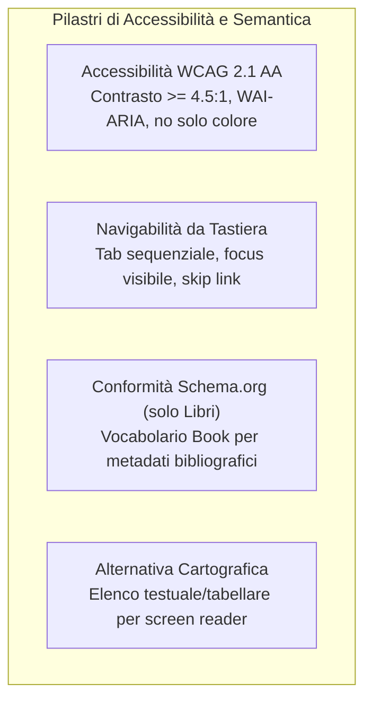

# Descrizione delle Scelte di Design UX e Accessibilità

> **Corso di Studio:** Laurea Triennale in Informatica per le Aziende Digitali (L-31)  
> **Tema n. 4:** Sharing technologies | **Traccia PW n. 14:** Sviluppo di un software di geolocalizzazione culturale per condividere il patrimonio librario degli utenti privati  
> **Progetto:** Hermae — Candidato: Nunzio Giglio (Matr. 0312200894)  
> **Riferimento:** Rapporto Tecnico — Sezione 4: Design UX e accessibilità  

---

## 1. Principi di Design, Reattività e Filosofia Mobile-to-First

L'interfaccia di **Hermae** è progettata per offrire un'esperienza d'uso fluida, immediata e uniforme su qualsiasi dispositivo:

- **Design Responsive e Filosofia "Mobile-to-First":** Il layout è sviluppato partendo prioritariamente dall'esperienza su smartphone — scenario d'uso primario per la consultazione e ricerca di libri in mobilità all'interno del quartiere o della città — per poi estendersi e adattarsi in modo ottimale a tablet, laptop e schermi desktop. Tale approccio assicura che il programma risponda perfettamente a tutti i tipi di dispositivi che gli utenti potrebbero impiegare per accedere alla piattaforma.
- **Ergonomia dei Controlli Touch:** Tutti i comandi interattivi (pulsanti, collegamenti, slider del raggio, controlli mappa) presentano un'area di tocco minima garantita di **$44 \times 44$ pixel**, prevenendo tocchi accidentali su schermi touch screen.
- **Navigazione Multi-Pagina Coerente:** La struttura su file HTML dedicati (`index.html`, `libro-dettaglio.html`, `pubblica.html`, ecc.) assicura linearità di percorso, barra di navigazione fissa e pieno supporto ai comandi nativi del browser (cronologia, tasti avanti/indietro, bookmarking).
- **Feedback e Gestione degli Stati:** Badge visivi e testuali per lo stato del libro (*Disponibile* / *In prestito*), indicatori di caricamento (*spinner*) durante le interrogazioni asincrone, alert contestuali e anteprima istantanea della copertina durante l'upload.

---

## 2. Accessibilità, Navigabilità da Tastiera e Standard Semantici

Il sistema integra nativamente accessibilità e semantica web per garantire un accesso universale e strutturato ai contenuti:

### 2.1 Navigabilità da Tastiera e Supporto alle Tecnologie Assistive
- **Pieno Controllo Sequenziale da Tastiera:** Tutte le funzionalità (navigazione tra pagine, apertura filtri, compilazione form, richiesta prestito) sono azionabili senza mouse tramite l'uso sequenziale dei tasti `Tab`, `Shift+Tab`, `Invio` e `Spazio`.
- **Focus Visibile Rinforzato:** Indicatore visivo di focus netto e costante (`:focus-visible`) su ogni elemento interattivo, agevolando chi naviga esclusivamente da tastiera.
- **Skip Link:** Presenza in cima a ogni pagina del comando *"Salta al contenuto principale"* per bypassare rapidamente la barra di navigazione.
- **Robustezza WAI-ARIA:** Tag semantici HTML5 nativi (`<header>`, `<nav>`, `<main>`, `<section>`, `<article>`, `<footer>`) e attributi ARIA (`aria-label`, `aria-describedby`, `aria-live="polite"`) per notificare vocalmente l'aggiornamento dinamico dei risultati su mappa.
- **Alternativa Testuale alla Mappa:** Vista complementare a **lista/tabella accessibile** ordinata per distanza, che consente agli utenti non vedenti con screen reader (NVDA, VoiceOver) di consultare il catalogo superando le barriere visive della mappa Leaflet.

### 2.2 Percepibilità e Contrasto Cromatico (WCAG 2.1 Livello AA)
- **Contrasti Cromatici Verificati:** Rispetto rigoroso del rapporto minimo di **$4.5:1$** per testo normale e **$3:1$** per testo grande ed elementi dell'interfaccia (WCAG Criterio 1.4.3).
- **Indipendenza dal Colore:** Nessuno stato è comunicato unicamente mediante variazione cromatica, ma è sempre affiancato da testo ed icone esplicative (*Bootstrap Icons*).
- **Attributi `alt` Significativi:** Copertine e miniature WebP provviste di testo alternativo descrittivo generato dinamicamente.

### 2.3 Conformità a Schema.org Circoscritta ai Libri
- **Marcatura Semantica Limitata ai Libri:** L'adozione dei dati strutturati di **Schema.org** è rigorosamente limitata ai metadati bibliografici (`schema.org/Book`: titolo, autore, anno, ISBN e disponibilità), agevolando la corretta catalogazione semantica del patrimonio librario.
- **Esclusione della Collocazione Geografica per Tutela della Privacy:** Per i dati di geolocalizzazione **non viene applicata alcuna marcatura semantica strutturata pubblica**. In conformità alle prescrizioni del **GDPR** e ai requisiti del programma, la tutela della riservatezza e dell'inviolabilità del domicilio ha priorità assoluta, impedendo l'indicizzazione o l'esposizione aperta delle coordinate private.

---

## 3. Design UX per la Riservatezza Territoriale

- **Visualizzazione Spaziale di Confidenzialità:** Sulla mappa pubblica, la posizione del libro non indica mai il civico esatto dell'abitazione, ma un'area circolare o centroide di quartiere (*spatial blurring* di 300–500 m).
- **Rassicurazione Visiva dell'Utente:** La scheda del volume riporta l'indicazione esplicita *"Posizione approssimata per la tutela della privacy"*, garantendo trasparenza e serenità all'utente condivisore.

---

## 4. Sintesi dell'Esperienza d'Uso

L'unione di un design **responsive mobile-to-first**, della piena **navigabilità da tastiera**, dell'**accessibilità (WCAG 2.1 AA)**, della conformità a **Schema.org circoscritta ai libri** e del rigoroso rispetto della **privacy GDPR per la geolocalizzazione** dà vita a un'applicazione culturale aperta, rapida e protetta per tutti gli utenti.
