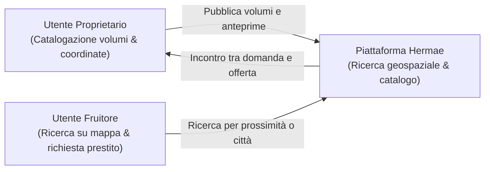

# Analisi del Contesto Operativo e Scelta dell'Ambito

> **Corso di Studio:** Laurea Triennale in Informatica per le Aziende Digitali (L-31)  
> **Tema n. 4:** Sharing technologies | **Traccia PW n. 14:** Sviluppo di un software di geolocalizzazione culturale per condividere il patrimonio librario degli utenti privati  
> **Progetto:** Hermae — Candidato: Nunzio Giglio (Matr. 0312200894)  
> **Riferimento:** Rapporto Tecnico — Sezione 1: Analisi del contesto operativo  

---

## 1. Inquadramento e Situazione-Problema

Il patrimonio librario privato (collezioni personali, biblioteche domestiche, raccolte di studio) rappresenta un capitale culturale diffuso ma **invisibile, frammentato e sottoutilizzato**.

Tale condizione genera una marcata **asimmetria informativa di prossimità**:
- Mancanza di strumenti aperti per censire e mostrare i volumi su scala locale;
- Impossibilità per i lettori di sapere se un testo d'interesse sia disponibile a poche centinaia di metri;
- Inadeguatezza delle soluzioni tradizionali: vincoli orari e lacune catalografiche delle biblioteche pubbliche, e costi/spedizioni dei mercati online che annullano la spontaneità dello scambio a chilometro zero.

**Hermae** risponde a questa criticità tramite le *Sharing Technologies*, offrendo una piattaforma di **geolocalizzazione culturale** che abilita la mappatura e la condivisione peer-to-peer del patrimonio privato.

---

## 2. Scelta e Delimitazione dell'Ambito Operativo

L'ambito operativo è individuato nella **dimensione cittadina e di quartiere**:

- **La Città e il Tessuto Urbano:** La città costituisce l'elemento cardine del tessuto insediativo italiano. Estendere l'ambito alla scala urbana garantisce una massa critica adeguata di volumi e prepara l'architettura della web app a una reale **scalabilità futura** (gestione di carichi crescenti, densità di punti e ricerche estese all'intero comune).
- **La Prossimità di Quartiere:** All'interno della città, il raggio di prossimità (500 m – 5 km) favorisce lo scambio diretto a piedi, in bicicletta o con il trasporto pubblico, azzerando le barriere economiche e logistiche.
- **Comunità Tematiche (Trattazione Implicita):** Realtà quali comunità universitarie e circoli culturali, per vincoli di tempo e risorse nello sviluppo prototipale, sono considerate come **insieme implicito** dell'utenza generale senza una formalizzazione applicativa dedicata. La loro strutturazione tramite profili ad hoc o sezioni riservate potrà essere considerata in implementazioni future.

---

## 3. Attori e Dinamiche dello Spazio Operativo

Il sistema modella l'interazione tra due ruoli primari nel contesto urbano:

- **Utente Proprietario (Condivisore):** Registra il profilo, inserisce i metadati del volume (titolo, autore, anno, categoria), carica la copertina e ne dichiara la disponibilità per consultazione o prestito.
- **Utente Fruitore (Richiedente):** Esplora la mappa filtrando per raggio o città, visualizza le anteprime e invia una richiesta simulata di prestito/consultazione.

---

## 4. Fattori Critici e Vincoli del Contesto Operativo

1. **Assenza di un Aggregatore Orientato alla Conoscenza:** Criticità intrinseca sia al contesto attuale sia alla progettazione del programma: la mancanza di un sistema di aggregazione libraria focalizzato sulla divulgazione e conoscenza dei testi piuttosto che sul commercio, che permetta prima di individuare uno specifico volume e solo successivamente di ricercarne la disponibilità fisica nell'area limitrofa o nella città in generale.
2. **Riservatezza Geografica (Privacy by Design - GDPR):** Essendo i beni custoditi in abitazioni private, la piattaforma tutela il domicilio applicando un raggio di confidenzialità (area approssimata a livello di quartiere/isolato) senza esporre il civico esatto.
3. **Accessibilità e Inclusività (WCAG 2.1):** Interfaccia usabile da dispositivi mobili, con contrasti cromatici a norma e compatibilità con tecnologie assistive.
4. **Ottimizzazione Media:** Generazione automatica di formati compressi (WebP) e miniature per garantire navigazione fluida su mappa anche con connettività limitata.

---

## 5. Sintesi del Valore Aggiunto

Integrando **inventario digitale e prossimità geografica**, Hermae supera i limiti delle casette fisiche non censite e dei social network privi di dimensione spaziale, restituendo al territorio urbano una rete culturale accessibile, scalabile e a chilometro zero.
