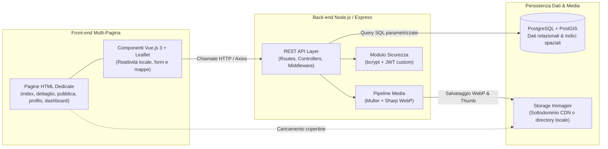

# Scelta dell'Architettura e delle Tecnologie

> **Corso di Studio:** Laurea Triennale in Informatica per le Aziende Digitali (L-31)  
> **Tema n. 4:** Sharing technologies | **Traccia PW n. 14:** Sviluppo di un software di geolocalizzazione culturale per condividere il patrimonio librario degli utenti privati  
> **Progetto:** Hermae — Candidato: Nunzio Giglio (Matr. 0312200894)  
> **Riferimento:** Rapporto Tecnico — Sezione 3: Architettura e tecnologie  

---

## 1. Modello Architetturale Generale

L'applicazione adotta un'architettura **Client-Server disaccoppiata**, fondata su servizi e API RESTful stateless:

- **Front-end Multi-Pagina (Pagine HTML dedicate):** Per garantire la massima semplicità di navigazione nativa tramite browser (utilizzo immediato di cronologia, pulsanti avanti/indietro, ricarica e bookmarking dei link), il front-end è articolato su file HTML autonomi (`index.html`, `libro-dettaglio.html`, `pubblica.html`, `profilo.html`, `dashboard.html`, `login.html`, `registrazione.html`). All'interno di ciascuna pagina sono montate istanze reattive di **Vue.js 3** per orchestrare dinamicamente mappe, form e aggiornamenti parziali.
- **Back-end RESTful:** Il server Node.js con Express espone endpoint JSON conformi ai verbi HTTP standard, disaccoppiando completamente la logica applicativa dalla presentazione.

---

## 2. Tech Stack Selezionato

| Livello Architetturale | Tecnologia Selezionata | Ruolo e Motivazione Tecnica |
| :--- | :--- | :--- |
| **Front-end Core & Reattività** | **Vue.js 3 (Composition API)** | Gestione reattiva dello stato dei form, dei filtri e delle interazioni utente all'interno delle pagine HTML, mantenendo il codice modulare e leggero. |
| **Interfaccia & Accessibilità** | **Bootstrap 5 + Icons** | Realizzazione di layout responsive (mobile-first) e conformi ai requisiti di accessibilità **WCAG 2.1 Livello AA / WAI-ARIA** (contrasti cromatici e navigazione da tastiera). |
| **Motore Mappe & GIS** | **Leaflet.js + OpenStreetMap** | Libreria cartografica client-side leggera e aperta per il rendering della mappa, dei marker georeferenziati e del raggio di ricerca. |
| **Visualizzazione Grafica** | **Chart.js** | Generazione dei grafici analitici per il monitoraggio delle metriche d'uso nella dashboard amministrativa. |
| **HTTP Client** | **Axios** | Chiamate asincrone verso il back-end con interceptor per l'iniezione automatica del token JWT negli header di autorizzazione. |
| **Runtime & Back-end** | **Node.js + Express.js** | Architettura a strati (*Routes*, *Controllers*, *Services*, *Middlewares*) per la gestione scalabile delle richieste di business logic. |
| **Autenticazione & Sicurezza** | **bcrypt + jsonwebtoken (JWT)** | Soluzione custom senza BaaS esterni: hashing crittografico delle password (salt $\ge 12$) e autenticazione stateless basata su token firmati. |

---

## 3. Base di Dati (Panoramica ad Alto Livello)

La persistenza dei dati è affidata al DBMS relazionale open-source **PostgreSQL**, potenziato dall'estensione geospaziale **PostGIS**:

- **Persistenza Relazionale:** Gestione strutturata di utenti, volumi, categorie tematiche, richieste di prestito e metriche di consultazione, garantendo consistenza transazionale (ACID) e integrità referenziale.
- **Supporto Geospaziale Nativo:** PostGIS introduce il tipo di dato nativo `Point` (standard WGS 84 / EPSG:4326) e indici spaziali ad albero **GiST** (*Generalized Search Tree*). Questo consente di eseguire calcoli di prossimità geodesica (`ST_DWithin`) con tempi di risposta inferiori a 200 ms sia su scala di quartiere sia su scala cittadina, assicurando la scalabilità dell'applicazione.
- **Interfaccia Applicativa:** Connessione tramite driver nativo `pg` con query SQL parametrizzate per prevenire vulnerabilità di tipo SQL Injection.

---

## 4. Sistema di Storage delle Immagini e Gestione Media

La gestione delle copertine dei libri e delle relative anteprime è ingegnerizzata per minimizzare l'occupazione di banda e garantire tempi di risposta rapidi:

### 4.1 Architettura dello Storage
I file grafici risiedono direttamente sul server di hosting applicativo, senza dipendenze da servizi cloud a pagamento:
- **Ambiente Online / Produzione:** I media sono erogati attraverso un sottodominio dedicato all'hosting statico (es. `cdn.hermae...` o analogo virtual host), separando il carico del traffico statico dalle chiamate API di business logic;
- **Ambiente di Sviluppo / Locale:** I file risiedono in una cartella dedicata del filesystem locale (`/uploads`), esposta direttamente tramite middleware statico di Express (`express.static`).

### 4.2 Pipeline di Upload e Transcodifica (Multer + Sharp)
1. **Validazione e Upload (Multer):** L'upload multipart è rigidamente vincolato da una whitelist sui soli formati grafici principali (**JPEG**, **PNG**, **WebP**); file non conformi o potenzialmente malevoli vengono respinti a livello di middleware.
2. **Ottimizzazione e Transcodifica (Sharp):** La libreria Sharp elabora asincronamente l'immagine caricata:
   - Converte il file nel formato compresso moderno **WebP**;
   - Genera contestualmente due risorse: la **copertina standard** (risoluzione 800px) per la scheda dettaglio e la **miniatura / thumbnail** (200px) per popup cartografici ed elenchi;
   - Riduce del **70–80%** il peso dei file rispetto ai formati originali, velocizzando il rendering su mappa in mobilità.

---

## 5. Sintesi dei Vantaggi Architetturali

Tale impostazione garantisce:
- **Semplicità di distribuzione e manutenzione:** Nessuna dipendenza da costosi servizi proprietari esterni;
- **Navigazione nativa e intuitiva:** Struttura a pagine HTML che valorizza i controlli del browser unita alla reattività mirata di Vue 3;
- **Scalabilità e conformità:** Efficienza geospaziale certificata con PostGIS e piena tutela dei dati personali degli utenti.
