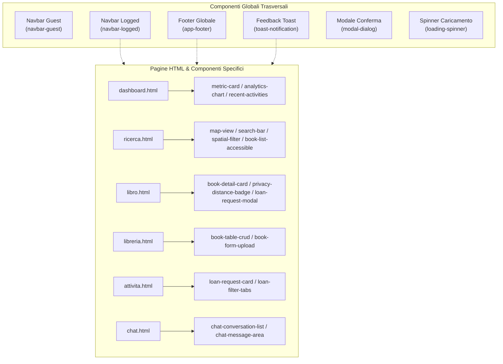

# Mappa dei Componenti Front-end (Components Map)

> **Corso di Studio:** Laurea Triennale in Informatica per le Aziende Digitali (L-31)  
> **Tema n. 4:** Sharing technologies | **Traccia PW n. 14:** Sviluppo di un software di geolocalizzazione culturale per condividere il patrimonio librario degli utenti privati  
> **Progetto:** Hermae — Candidato: Nunzio Giglio (Matr. 0312200894)  
> **Riferimento:** Rapporto Tecnico — Sezione 6 / Fase 7: Analisi dei componenti dell'applicazione  

---

## 1. Approccio Architetturale ai Componenti

Nell'architettura multi-pagina di **Hermae**, i componenti sono implementati tramite **Vue.js 3 (Composition API)** e stilizzati con **Bootstrap 5**. Essi si suddividono in due categorie principali:

1. **Componenti Globali:** Elementi trasversali condivisi e inclusi in tutte (o quasi tutte) le pagine HTML, deputati alla struttura di navigazione, al layout coerente e al feedback di sistema.
2. **Componenti Specifici (View Components):** Moduli dedicati al soddisfacimento delle funzionalità specifiche della singola pagina (gestione mappa, upload copertina, grafici analitici, messaggistica).

---

## 2. Componenti Globali (Layout e Utilità)

I componenti globali garantiscono consistenza grafica, conformità agli standard di accessibilità **WCAG 2.1 AA** e uniformità di feedback per l'utente:

| Componente | Nome Tag / ID | Pagine di Utilizzo | Responsabilità Funzionale | Dipendenze |
| :--- | :--- | :--- | :--- | :--- |
| **Navbar Guest** | `<navbar-guest>` | `login.html`, `registrazione.html`, `logout.html` | Intestazione minima per utenti non autenticati con logo Hermae e link di commutazione tra Accesso e Registrazione. | Bootstrap 5 Navbar |
| **Navbar Logged** | `<navbar-logged>` | Tutte le pagine riservate (`dashboard`, `ricerca`, `libreria`, ecc.) | Barra principale per utenti autenticati con brand, link rapidi alle sezioni (Dashboard, Mappa, Libreria, Attività, Chat), menu utente a tendina (Account, Impostazioni, Logout) e badge notifiche. | Bootstrap 5, `auth.js` |
| **App Footer** | `<app-footer>` | Tutte le pagine HTML | Piè di pagina uniforme con crediti di progetto, informativa legale GDPR, conformità WCAG 2.1 AA e link a documentazione. | Bootstrap 5 |
| **Toast Notification** | `<toast-notification>` | Tutte le pagine HTML | Contenitore reattivo per messaggi temporanei di feedback asincrono (es. successo salvataggio, errori HTTP 401/403/500, notifica nuova richiesta). | Bootstrap 5 Toasts, Axios |
| **Loading Spinner** | `<loading-spinner>` | Tutte le pagine con chiamate API | Overlay o indicatore visivo accessibile (`role="status"`, `aria-live="polite"`) per segnalare operazioni asincrone in corso (ricerche spaziali, upload file). | CSS / WAI-ARIA |
| **Modal Dialog** | `<modal-dialog>` | Tutte le pagine riservate | Finestra di dialogo accessibile per richieste di conferma critiche (es. cancellazione libro dalla libreria, conferma richiesta di prestito, revoca consensi). | Bootstrap 5 Modals, WAI-ARIA |

---

## 3. Componenti Specifici di Pagina (Domain Components)

I componenti specifici incapsulano la business logic e le interazioni specializzate di ciascuna vista:

| Area Funzionale | Componente | Tag / Modulo | Responsabilità e Proprietà Chiave |
| :--- | :--- | :--- | :--- |
| **Ricerca & Mappa** (`ricerca.html`) | **Map View** | `<map-view>` | Integrazione con Leaflet.js: visualizzazione cartografica OSM, rendering dei marker georeferenziati, raggio visivo circolare e popup con miniatura WebP. |
| | **Search Bar** | `<search-bar>` | Input con *debounce* per la ricerca testuale combinata (titolo, autore, ISBN, categorie). |
| | **Spatial Filter** | `<spatial-filter>` | Controlli interattivi: slider del raggio chilometrico (1–50 km) e selettore città per filtrare le query PostGIS `ST_DWithin`. |
| | **Book List Accessible** | `<book-list-accessible>` | Vista alternativa a elenco/tabella ordinata per distanza, pienamente compatibile con screen reader per utenti non vedenti. |
| **Dettaglio Libro** (`libro.html`) | **Book Detail Card** | `<book-detail-card>` | Rendering dei metadati del volume con marcatura semantica **`schema.org/Book`**, copertina WebP ad alta risoluzione e badge di stato (*Disponibile* / *In prestito*). |
| | **Privacy Distance Badge** | `<privacy-distance-badge>` | Visualizzazione della distanza stimata accompagnata dall'avviso esplicito di **raggio di confidenzialità (300–500 m)** a tutela della privacy del domicilio. |
| | **Loan Request Modal** | `<loan-request-modal>` | Modale per l'invio della richiesta di prestito/consultazione simulata con campo messaggio opzionale al proprietario. |
| **Dashboard** (`dashboard.html`) | **Metric Card** | `<metric-card>` | Stat-card per la visualizzazione immediata dei KPI personali e territoriali (prestiti attivi, libri censiti, visualizzazioni ricevute). |
| | **Analytics Chart** | `<analytics-chart>` | Wrapper reattivo Chart.js per la rappresentazione grafica delle metriche temporali e delle categorie più attive. |
| | **Recent Activities** | `<recent-activities>` | Feed cronologico delle ultime interazioni (richieste ricevute, avanzamenti di stato, avvisi). |
| **Libreria Personale** (`libreria.html`) | **Book Table CRUD** | `<book-table-crud>` | Tabella reattiva con l'elenco dei libri posseduti dall'utente, filtri per stato e pulsanti per modifica metadati o cancellazione. |
| | **Book Form Upload** | `<book-form-upload>` | Form accessibile per l'inserimento metadati, selezione geografica e upload copertina con whitelist formati (JPEG, PNG, WebP) e anteprima istantanea. |
| **Attività Prestiti** (`attivita.html`) | **Loan Request Card** | `<loan-request-card>` | Scheda singola per ciascun prestito: visualizzazione del libro, controparte, data richiesta, badge di stato e comandi di avanzamento (*Accetta*, *Rifiuta*, *Concludi*). |
| | **Loan Filter Tabs** | `<loan-filter-tabs>` | Navigazione a schede per commutare tra *Richieste Ricevute* e *Richieste Inviate* e filtrare per stato. |
| **Chat & Accordi** (`chat.html`) | **Chat Conversation List** | `<chat-conversation-list>` | Elenco delle conversazioni attive indicizzate per libro/utente con indicatore di messaggi non letti. |
| | **Chat Message Area** | `<chat-message-area>` | Finestra messaggi con storico ordinato temporalmente, box di inserimento testo e invio asincrono tramite API. |
| **Profilo & Privacy** (`account.html`, `impostazioni.html`) | **Profile Form** | `<profile-form>` | Form per la modifica delle informazioni personali dell'account (recapiti, credenziali, password). |
| | **Privacy Consent Manager** | `<privacy-consent-manager>` | Interfaccia per la visualizzazione e la revoca granulare dei consensi informati conformi al **GDPR** (trattamento dati, geolocalizzazione). |

---

## 4. Matrice di Correlazione Pagine vs Componenti

La matrice seguente documenta la riusabilità dei componenti sulle 11 pagine dell'applicazione:

| Pagina HTML | Componenti Globali Inclusi | Componenti Specifici Montati |
| :--- | :--- | :--- |
| `login.html` | `<navbar-guest>`, `<app-footer>`, `<toast-notification>` | Form di login con validazione JWT |
| `registrazione.html` | `<navbar-guest>`, `<app-footer>`, `<toast-notification>` | Form onboarding con geocodifica e consensi GDPR |
| `logout.html` | `<navbar-guest>`, `<app-footer>` | Script di reset storage e redirect timer |
| `dashboard.html` *(Home)* | `<navbar-logged>`, `<app-footer>`, `<toast-notification>` | `<metric-card>`, `<analytics-chart>`, `<recent-activities>` |
| `ricerca.html` | `<navbar-logged>`, `<app-footer>`, `<loading-spinner>` | `<map-view>`, `<search-bar>`, `<spatial-filter>`, `<book-list-accessible>` |
| `libro.html` | `<navbar-logged>`, `<app-footer>`, `<modal-dialog>` | `<book-detail-card>`, `<privacy-distance-badge>`, `<loan-request-modal>` |
| `libreria.html` | `<navbar-logged>`, `<app-footer>`, `<toast-notification>`, `<modal-dialog>` | `<book-table-crud>`, `<book-form-upload>` |
| `attivita.html` | `<navbar-logged>`, `<app-footer>`, `<toast-notification>` | `<loan-request-card>`, `<loan-filter-tabs>` |
| `chat.html` | `<navbar-logged>`, `<app-footer>`, `<toast-notification>` | `<chat-conversation-list>`, `<chat-message-area>` |
| `account.html` | `<navbar-logged>`, `<app-footer>`, `<toast-notification>` | `<profile-form>` |
| `impostazioni.html` | `<navbar-logged>`, `<app-footer>`, `<toast-notification>`, `<modal-dialog>` | `<privacy-consent-manager>` |

---

## 5. Standard di Sviluppo dei Componenti

- **Integrazione WAI-ARIA:** Ogni componente interattivo include etichette `aria-label`, ruoli semantici e focus management visibile (`:focus-visible`).
- **Incapsulamento e Riutilizzo:** I componenti globali sono inclusi nei template HTML comuni; i componenti specifici sono isolati in moduli JavaScript (`assets/js/components/*.js`) e importati selettivamente nelle sole pagine di competenza per ottimizzare tempi di caricamento e memoria del browser.
