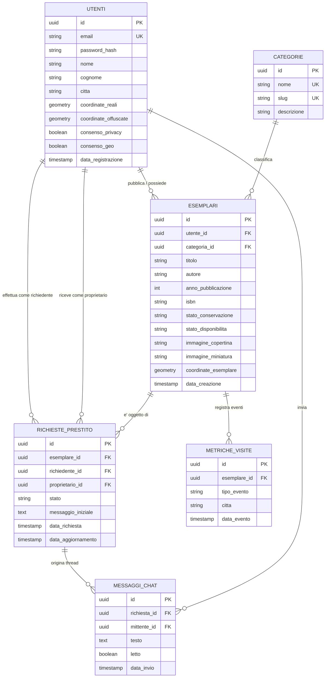

# Definizione del Modello e dello Schema di Database

> **Corso di Studio:** Laurea Triennale in Informatica per le Aziende Digitali (L-31)  
> **Tema n. 4:** Sharing technologies | **Traccia PW n. 14:** Sviluppo di un software di geolocalizzazione culturale per condividere il patrimonio librario degli utenti privati  
> **Progetto:** Hermae — Candidato: Nunzio Giglio (Matr. 0312200894)  
> **Riferimento:** Rapporto Tecnico — Sezione 7 / Fase 8: Progettazione concettuale e logica della base di dati  

---

## 1. Introduzione e Scelte di Modellazione

La base di dati di **Hermae** è implementata sul DBMS relazionale **PostgreSQL** con estensione **PostGIS**, integrando rigorosi principi di ingegneria del software, sicurezza applicativa e modellazione concettuale:

1. **Adozione di Identificatori Univoci Globali (UUID / UID):**  
   Tutte le entità del sistema abbandonano gli ID progressivi interi (`SERIAL`) in favore di identificatori univoci universali di tipo **`UUID` (v4)**, generati nativamente tramite la funzione crittografica `gen_random_uuid()`. Tale scelta garantisce:
   - **Sicurezza e Prevenzione IDOR:** Impedisce attacchi di tipo *Insecure Direct Object Reference*, impedendo a soggetti malevoli di enumerare le risorse (es. tentando di scaricare `/libri/1`, `/libri/2`, ecc.);
   - **Tutela della Privacy di Sistema:** Non rivela a terzi il volume complessivo di utenti registrati o copie inserite nel tempo;
   - **Disaccoppiamento e Scalabilità Distribuita:** Permette la generazione sicura di identificatori anche prima della transazione su database.

2. **Ridenominazione dell'Entità in "Esemplari" (*Items / Copies*):**  
   In ossequio ai modelli internazionali di catalogazione e modellazione bibliografica (standard concettuale **IFLA LRM / FRBR**), l'entità precedentemente indicata come "Libri" viene formalizzata come **`esemplari`**:
   - Un *"libro"* o opera letteraria costituisce un'astrazione intellettuale ed editoriale (titolo, autore, codice ISBN);
   - Ciò che risiede fisicamente presso l'abitazione dell'utente privato, che viene geolocalizzato, fotografato, inserito nella libreria, verificato nello stato d'usura e concesso in prestito temporaneo è la **singola copia fisica materiale**, ovvero l'**Esemplare**.

3. **Gestione Geospaziale Nativa e Privacy-by-Design (GDPR):**  
   Tutte le coordinate territoriali sono modellate secondo lo standard geodetico **WGS 84 (EPSG:4326)** tramite tipo dedicato `GEOMETRY(Point, 4326)` e indicizzate mediante alberi multidimensionali **GiST** per garantire query di prossimità geodesica (`ST_DWithin`) inferiori a 200 ms. A tutela del domicilio dell'utente, le coordinate pubbliche dell'esemplare recepiscono il principio di *spatial blurring* (area di confidenzialità di 300–500 m).

---

## 2. Modello Concettuale Entità-Relazione (Diagramma E-R)

Il diagramma concettuale formalizza le 6 entità di sistema, le relative relazioni e l'uso uniforme degli identificatori **UUID**:



---

## 3. Modello Logico e Dizionario Dati delle Tabelle

### 3.1 Tabella `utenti`
Memorizza i profili registrati, le credenziali cifrate con bcrypt, i consensi GDPR e le coordinate WGS 84.

| Colonna | Tipo Dato SQL | Vincoli | Descrizione Funzionale |
| :--- | :--- | :--- | :--- |
| `id` | `UUID` | `PRIMARY KEY, DEFAULT gen_random_uuid()` | Identificatore univoco globale dell'utente (non progressivo). |
| `email` | `VARCHAR(255)` | `NOT NULL, UNIQUE` | Indirizzo email (login univoco di accesso). |
| `password_hash` | `VARCHAR(255)` | `NOT NULL` | Hash crittografico generato tramite **bcrypt** (salt $\ge 12$). |
| `nome` | `VARCHAR(100)` | `NOT NULL` | Nome dell'utente. |
| `cognome` | `VARCHAR(100)` | `NOT NULL` | Cognome dell'utente. |
| `citta` | `VARCHAR(100)` | `NOT NULL` | Comune/città di residenza (per filtri a scala urbana). |
| `coordinate_reali` | `GEOMETRY(Point, 4326)` | `NOT NULL` | Coordinate spaziali WGS 84 fornite in fase di registrazione. |
| `coordinate_offuscate` | `GEOMETRY(Point, 4326)` | `NOT NULL` | Punto perturbato (*spatial blurring* 300–500 m) per tutelare il domicilio. |
| `consenso_privacy` | `BOOLEAN` | `NOT NULL, DEFAULT FALSE` | Consenso esplicito al trattamento dati personali (GDPR). |
| `consenso_geo` | `BOOLEAN` | `NOT NULL, DEFAULT FALSE` | Consenso esplicito alla geolocalizzazione culturale. |
| `data_registrazione` | `TIMESTAMP` | `DEFAULT CURRENT_TIMESTAMP` | Timestamp di registrazione account. |

### 3.2 Tabella `categorie`
Tassonomia per la categorizzazione disciplinare e letteraria degli esemplari.

| Colonna | Tipo Dato SQL | Vincoli | Descrizione Funzionale |
| :--- | :--- | :--- | :--- |
| `id` | `UUID` | `PRIMARY KEY, DEFAULT gen_random_uuid()` | Identificatore univoco della categoria tematica. |
| `nome` | `VARCHAR(100)` | `NOT NULL, UNIQUE` | Nome esteso (es. Narrativa, Saggistica, Informatica, Storia). |
| `slug` | `VARCHAR(100)` | `NOT NULL, UNIQUE` | Identificatore testuale URL-friendly per filtri web. |
| `descrizione` | `TEXT` | `NULL` | Descrizione facoltativa della categoria. |

### 3.3 Tabella `esemplari` *(Ex Libri)*
Catalogo delle copie fisiche possedute dai privati con metadati bibliografici, cover WebP e coordinate territoriali.

| Colonna | Tipo Dato SQL | Vincoli | Descrizione Funzionale |
| :--- | :--- | :--- | :--- |
| `id` | `UUID` | `PRIMARY KEY, DEFAULT gen_random_uuid()` | Identificatore univoco globale dell'esemplare fisico. |
| `utente_id` | `UUID` | `NOT NULL, FK -> utenti(id)` | Riferimento al proprietario della copia (`ON DELETE CASCADE`). |
| `categoria_id` | `UUID` | `NOT NULL, FK -> categorie(id)` | Riferimento alla categoria tematica (`ON DELETE RESTRICT`). |
| `titolo` | `VARCHAR(255)` | `NOT NULL` | Titolo dell'opera (`schema.org/Book: name`). |
| `autore` | `VARCHAR(255)` | `NOT NULL` | Autore dell'opera (`schema.org/Book: author`). |
| `anno_pubblicazione` | `SMALLINT` | `NULL` | Anno di edizione dello specifico esemplare cartaceo. |
| `isbn` | `VARCHAR(20)` | `NULL` | Codice ISBN-10 o ISBN-13 dell'edizione. |
| `descrizione` | `TEXT` | `NULL` | Note specifiche sull'esemplare (stato d'uso, annotazioni). |
| `stato_conservazione` | `VARCHAR(50)` | `DEFAULT 'Buono'` | Condizione fisica materiale (es. *Come nuovo*, *Buono*, *Usurato*). |
| `stato_disponibilita` | `VARCHAR(30)` | `NOT NULL, DEFAULT 'DISPONIBILE'` | Stato corrente della copia (*DISPONIBILE*, *IN_PRESTITO*, *NON_DISPONIBILE*). |
| `immagine_copertina` | `VARCHAR(255)` | `NULL` | Percorso relativo della cover standard WebP (800px). |
| `immagine_miniatura` | `VARCHAR(255)` | `NULL` | Percorso relativo della miniatura WebP (200px). |
| `coordinate_esemplare`| `GEOMETRY(Point, 4326)` | `NOT NULL` | Collocazione geografica con raggio di confidenzialità (300–500 m). |
| `data_creazione` | `TIMESTAMP` | `DEFAULT CURRENT_TIMESTAMP` | Timestamp di pubblicazione dell'esemplare. |

### 3.4 Tabella `richieste_prestito`
Gestisce la macchina a stati delle richieste di contatto e prestito peer-to-peer per un determinato esemplare.

| Colonna | Tipo Dato SQL | Vincoli | Descrizione Funzionale |
| :--- | :--- | :--- | :--- |
| `id` | `UUID` | `PRIMARY KEY, DEFAULT gen_random_uuid()` | Identificatore univoco della richiesta di prestito. |
| `esemplare_id` | `UUID` | `NOT NULL, FK -> esemplari(id)` | Esemplare fisico oggetto della richiesta (`ON DELETE CASCADE`). |
| `richiedente_id` | `UUID` | `NOT NULL, FK -> utenti(id)` | Utente che richiede il prestito/consultazione. |
| `proprietario_id` | `UUID` | `NOT NULL, FK -> utenti(id)` | Utente possessore dell'esemplare. |
| `stato` | `VARCHAR(30)` | `NOT NULL, DEFAULT 'IN_ATTESA'` | Stato: `IN_ATTESA`, `ACCETTATA`, `RIFIUTATA`, `CONCLUSA`. |
| `messaggio_iniziale` | `TEXT` | `NULL` | Messaggio inviato dal richiedente al primo contatto. |
| `data_richiesta` | `TIMESTAMP` | `DEFAULT CURRENT_TIMESTAMP` | Data e ora di apertura della richiesta. |
| `data_aggiornamento` | `TIMESTAMP` | `DEFAULT CURRENT_TIMESTAMP` | Timestamp dell'ultimo cambio di stato. |

### 3.5 Tabella `messaggi_chat`
Messaggi asincroni scambiati tra richiedente e proprietario relativi a una specifica richiesta di prestito.

| Colonna | Tipo Dato SQL | Vincoli | Descrizione Funzionale |
| :--- | :--- | :--- | :--- |
| `id` | `UUID` | `PRIMARY KEY, DEFAULT gen_random_uuid()` | Identificatore univoco del messaggio. |
| `richiesta_id` | `UUID` | `NOT NULL, FK -> richieste_prestito(id)` | Richiesta a cui fa capo la conversazione (`ON DELETE CASCADE`). |
| `mittente_id` | `UUID` | `NOT NULL, FK -> utenti(id)` | Utente autore del messaggio. |
| `testo` | `TEXT` | `NOT NULL` | Contenuto testuale del messaggio. |
| `letto` | `BOOLEAN` | `DEFAULT FALSE` | Flag di lettura per notifiche badge. |
| `data_invio` | `TIMESTAMP` | `DEFAULT CURRENT_TIMESTAMP` | Timestamp di invio. |

### 3.6 Tabella `metriche_visite`
Tracciamento analitico anonimizzato delle interazioni sugli esemplari per la dashboard.

| Colonna | Tipo Dato SQL | Vincoli | Descrizione Funzionale |
| :--- | :--- | :--- | :--- |
| `id` | `UUID` | `PRIMARY KEY, DEFAULT gen_random_uuid()` | Identificatore univoco dell'evento analitico. |
| `esemplare_id` | `UUID` | `NULL, FK -> esemplari(id)` | Esemplare consultato (`ON DELETE SET NULL`). |
| `tipo_evento` | `VARCHAR(50)` | `NOT NULL` | Evento: `VISUALIZZAZIONE_SCHEDA`, `RICERCA_SPAZIALE`, `PRESTITO_AVVIATO`. |
| `citta` | `VARCHAR(100)` | `NULL` | Città dell'evento per aggregazioni territoriali. |
| `data_evento` | `TIMESTAMP` | `DEFAULT CURRENT_TIMESTAMP` | Timestamp dell'interazione. |

---

## 4. Specifiche Geospaziali e Strategia di Indicizzazione

1. **Indici Spaziali GiST (Generalized Search Tree):**
   - Indice GiST su `esemplari(coordinate_esemplare)`: ottimizza le query di prossimità geodesica `ST_DWithin` per raggio metrico (da 1 a 50 km) mantenendo la risposta $< 200\text{ ms}$;
   - Indice GiST su `utenti(coordinate_offuscate)`: per calcoli statistici territoriali.
2. **Indici B-Tree su UUID e Chiavi Esterne (FK):**
   - Indici dedicati su tutte le chiavi esterne (`utente_id`, `categoria_id`, `esemplare_id`, `richiedente_id`, `proprietario_id`, `richiesta_id`) per massimizzare le prestazioni delle operazioni di `JOIN` tra UUID.
3. **Indici B-Tree per Ricerca Testuale e Filtri:**
   - Indici su `esemplari(titolo)`, `esemplari(autore)` e `esemplari(isbn)` per la ricerca testuale;
   - Indice su `esemplari(stato_disponibilita)` per isolare tempestivamente le copie disponibili allo scambio.

---

## 5. Script DDL di Creazione Schema (PostgreSQL + PostGIS)

```sql
-- 1. Attivazione delle estensioni: PostGIS (GIS) e pgcrypto (UUID)
CREATE EXTENSION IF NOT EXISTS postgis;
CREATE EXTENSION IF NOT EXISTS "pgcrypto";

-- 2. Creazione Tabella UTENTI
CREATE TABLE IF NOT EXISTS utenti (
    id UUID PRIMARY KEY DEFAULT gen_random_uuid(),
    email VARCHAR(255) NOT NULL UNIQUE,
    password_hash VARCHAR(255) NOT NULL,
    nome VARCHAR(100) NOT NULL,
    cognome VARCHAR(100) NOT NULL,
    citta VARCHAR(100) NOT NULL,
    coordinate_reali GEOMETRY(Point, 4326) NOT NULL,
    coordinate_offuscate GEOMETRY(Point, 4326) NOT NULL,
    consenso_privacy BOOLEAN NOT NULL DEFAULT FALSE,
    consenso_geo BOOLEAN NOT NULL DEFAULT FALSE,
    data_registrazione TIMESTAMP DEFAULT CURRENT_TIMESTAMP
);

-- 3. Creazione Tabella CATEGORIE
CREATE TABLE IF NOT EXISTS categorie (
    id UUID PRIMARY KEY DEFAULT gen_random_uuid(),
    nome VARCHAR(100) NOT NULL UNIQUE,
    slug VARCHAR(100) NOT NULL UNIQUE,
    descrizione TEXT
);

-- 4. Creazione Tabella ESEMPLARI (Copia fisica del volume posseduta dall'utente)
CREATE TABLE IF NOT EXISTS esemplari (
    id UUID PRIMARY KEY DEFAULT gen_random_uuid(),
    utente_id UUID NOT NULL REFERENCES utenti(id) ON DELETE CASCADE,
    categoria_id UUID NOT NULL REFERENCES categorie(id) ON DELETE RESTRICT,
    titolo VARCHAR(255) NOT NULL,
    autore VARCHAR(255) NOT NULL,
    anno_pubblicazione SMALLINT,
    isbn VARCHAR(20),
    descrizione TEXT,
    stato_conservazione VARCHAR(50) DEFAULT 'Buono',
    stato_disponibilita VARCHAR(30) NOT NULL DEFAULT 'DISPONIBILE',
    immagine_copertina VARCHAR(255),
    immagine_miniatura VARCHAR(255),
    coordinate_esemplare GEOMETRY(Point, 4326) NOT NULL,
    data_creazione TIMESTAMP DEFAULT CURRENT_TIMESTAMP
);

-- 5. Creazione Tabella RICHIESTE_PRESTITO
CREATE TABLE IF NOT EXISTS richieste_prestito (
    id UUID PRIMARY KEY DEFAULT gen_random_uuid(),
    esemplare_id UUID NOT NULL REFERENCES esemplari(id) ON DELETE CASCADE,
    richiedente_id UUID NOT NULL REFERENCES utenti(id) ON DELETE CASCADE,
    proprietario_id UUID NOT NULL REFERENCES utenti(id) ON DELETE CASCADE,
    stato VARCHAR(30) NOT NULL DEFAULT 'IN_ATTESA',
    messaggio_iniziale TEXT,
    data_richiesta TIMESTAMP DEFAULT CURRENT_TIMESTAMP,
    data_aggiornamento TIMESTAMP DEFAULT CURRENT_TIMESTAMP
);

-- 6. Creazione Tabella MESSAGGI_CHAT
CREATE TABLE IF NOT EXISTS messaggi_chat (
    id UUID PRIMARY KEY DEFAULT gen_random_uuid(),
    richiesta_id UUID NOT NULL REFERENCES richieste_prestito(id) ON DELETE CASCADE,
    mittente_id UUID NOT NULL REFERENCES utenti(id) ON DELETE CASCADE,
    testo TEXT NOT NULL,
    letto BOOLEAN DEFAULT FALSE,
    data_invio TIMESTAMP DEFAULT CURRENT_TIMESTAMP
);

-- 7. Creazione Tabella METRICHE_VISITE
CREATE TABLE IF NOT EXISTS metriche_visite (
    id UUID PRIMARY KEY DEFAULT gen_random_uuid(),
    esemplare_id UUID REFERENCES esemplari(id) ON DELETE SET NULL,
    tipo_evento VARCHAR(50) NOT NULL,
    citta VARCHAR(100),
    data_evento TIMESTAMP DEFAULT CURRENT_TIMESTAMP
);

-- 8. Indici Spaziali GiST
CREATE INDEX IF NOT EXISTS idx_esemplari_coordinate ON esemplari USING GIST (coordinate_esemplare);
CREATE INDEX IF NOT EXISTS idx_utenti_coordinate_offuscate ON utenti USING GIST (coordinate_offuscate);

-- 9. Indici B-Tree per Ricerche e Prestazioni Relazionali su UUID
CREATE INDEX IF NOT EXISTS idx_esemplari_titolo ON esemplari (titolo);
CREATE INDEX IF NOT EXISTS idx_esemplari_autore ON esemplari (autore);
CREATE INDEX IF NOT EXISTS idx_esemplari_isbn ON esemplari (isbn);
CREATE INDEX IF NOT EXISTS idx_esemplari_disponibilita ON esemplari (stato_disponibilita);
CREATE INDEX IF NOT EXISTS idx_esemplari_utente ON esemplari (utente_id);
CREATE INDEX IF NOT EXISTS idx_esemplari_categoria ON esemplari (categoria_id);
CREATE INDEX IF NOT EXISTS idx_richieste_esemplare ON richieste_prestito (esemplare_id);
CREATE INDEX IF NOT EXISTS idx_richieste_richiedente ON richieste_prestito (richiedente_id);
CREATE INDEX IF NOT EXISTS idx_richieste_proprietario ON richieste_prestito (proprietario_id);
CREATE INDEX IF NOT EXISTS idx_chat_richiesta ON messaggi_chat (richiesta_id);
```

---

## 6. Sintesi dei Benefici del Modello Dati

L'adozione degli **UUID** e la formalizzazione dell'entità **Esemplari**:
1. **Elevano la sicurezza e la riservatezza:** Eliminano la vulnerabilità all'enumerazione di risorse (IDOR) e mantengono opaca la dimensione reale del database;
2. **Adottano il rigore biblioteconomico (IFLA LRM):** Distinguono con precisione l'opera intellettuale astratta dalla copia fisica concreta custodita dal cittadino;
3. **Garantiscono robustezza e scalabilità territoriale:** Mantengono l'efficienza degli indici spaziali GiST per ricerche fulminee sia a livello di quartiere che su scala cittadina.
