# Work Breakdown Structure (WBS) - Progetto Hermae

> **Titolo del Progetto:** Hermae — Sviluppo di un software di geolocalizzazione culturale per condividere il patrimonio librario degli utenti privati  
> **Autore:** Nunzio Giglio (Matr. 0312200894)  
> **Corso di Laurea:** Informatica per le Aziende Digitali (L-31)  
> **Tema:** n. 4 "Sharing Technologies" | **Project Work:** n. 14  

---

## 1. Rappresentazione Grafica della WBS (Albero Gerarchico)

```mermaid
graph TD
    HERMAE["1.0 HERMAE: Sistema di Geolocalizzazione Culturale"]

    WP1["1.1 Analisi e Definizione Requisiti"]
    WP2["1.2 Progettazione Architetturale e Design"]
    WP3["1.3 Sviluppo Back-end e Persistenza GIS"]
    WP4["1.4 Sviluppo Front-end e UI/UX"]
    WP5["1.5 Collaudo, Accessibilità e Sicurezza"]
    WP6["1.6 Documentazione e Rapporto Tecnico"]

    HERMAE --> WP1
    HERMAE --> WP2
    HERMAE --> WP3
    HERMAE --> WP4
    HERMAE --> WP5
    HERMAE --> WP6

    %% WP1
    WP1 --> W11["1.1.1 Analisi contesto operativo e sharing librario"]
    WP1 --> W12["1.1.2 Specifiche requisiti funzionali"]
    WP1 --> W13["1.1.3 Specifiche requisiti non funzionali (GDPR, WCAG)"]

    %% WP2
    WP2 --> W21["1.2.1 Progettazione architettura REST & SPA"]
    WP2 --> W22["1.2.2 Modellazione DB PostgreSQL + PostGIS"]
    WP2 --> W23["1.2.3 Design wireframe UI e alberatura rotte"]
    WP2 --> W24["1.2.4 Progettazione sicurezza e pipeline immagini"]

    %% WP3
    WP3 --> W31["1.3.1 Setup runtime Express e driver pg"]
    WP3 --> W32["1.3.2 Script DDL PostGIS e seeding di test"]
    WP3 --> W33["1.3.3 Modulo Auth (bcrypt + JWT custom)"]
    WP3 --> W34["1.3.4 Servizi GIS (query spaziali ST_DWithin)"]
    WP3 --> W35["1.3.5 Pipeline immagini (Multer + Sharp WebP)"]
    WP3 --> W36["1.3.6 API prestiti, statistiche e dashboard"]

    %% WP4
    WP4 --> W41["1.4.1 Scaffolding Vue 3 e Bootstrap 5"]
    WP4 --> W42["1.4.2 Client Axios centralizzato con Interceptors"]
    WP4 --> W43["1.4.3 Vista Mappa e filtri spaziali (Leaflet.js)"]
    WP4 --> W44["1.4.4 Viste Autenticazione e Profilo"]
    WP4 --> W45["1.4.5 Form pubblicazione libro accessibile"]
    WP4 --> W46["1.4.6 Scheda dettaglio libro e richiesta prestito"]
    WP4 --> W47["1.4.7 Dashboard analitica (Chart.js)"]

    %% WP5
    WP5 --> W51["1.5.1 Test funzionali end-to-end"]
    WP5 --> W52["1.5.2 Audit accessibilità WCAG 2.1 / WAI-ARIA"]
    WP5 --> W53["1.5.3 Benchmark query geospaziali ed indici GiST"]
    WP5 --> W54["1.5.4 Validazione sicurezza e conformità GDPR"]

    %% WP6
    WP6 --> W61["1.6.1 Redazione Parte Prima (Processo e risorse)"]
    WP6 --> W62["1.6.2 Redazione Parte Seconda (Elaborato e aspetti progettuali)"]
    WP6 --> W63["1.6.3 Commento codice sorgente e README repository"]
    WP6 --> W64["1.6.4 Revisione finale e compilazione PDF"]
```

---

## 2. Dizionario della WBS (Work Breakdown Structure Dictionary)

### WP 1.1 — Analisi dei Requisiti e Studio di Fattibilità
- **1.1.1 Analisi del contesto operativo e sharing librario:** Studio delle dinamiche di condivisione culturale e micro-biblioteche private; identificazione del target di riferimento (quartieri, comunità urbane, circoli culturali).
- **1.1.2 Specifiche dei requisiti funzionali:** Definizione delle casistiche d'uso (pubblicazione volumi, geocodifica, filtri per raggio chilometrico, richiesta prestito simulata, gestione stato disponibilità, cruscotto statistiche).
- **1.1.3 Specifiche dei requisiti non funzionali:** Definizione dei vincoli prestazionali (risposta query spaziali < 200ms), standard di usabilità e accessibilità (**WCAG 2.1 Livello AA / WAI-ARIA**), e adempimenti normativi per la privacy (**GDPR**, consenso granulare alla geolocalizzazione).
- *Deliverable:* Documento di specifica dei requisiti funzionali e non funzionali.
- *Stima impegno:* ~15 ore.

---

### WP 1.2 — Progettazione Architetturale e di Sistema
- **1.2.1 Progettazione architettura REST & SPA:** Definizione dell'architettura disaccoppiata client-server; specifica dei contratti API RESTful (endpoint, verbi HTTP, status code, strutture JSON).
- **1.2.2 Modellazione DB PostgreSQL + PostGIS:** Progettazione dello schema logico-concettuale E-R; definizione delle tabelle (`utenti`, `libri`, `categorie`, `prestiti`, `metriche_visite`); scelta del tipo geografico `GEOMETRY(Point, 4326)` e indicizzazione spaziale `GIST`.
- **1.2.3 Design wireframe UI e alberatura rotte:** Progettazione dell'albero di navigazione client (`Vue Router` con History API) e dei mockup wireframe per le viste desktop e mobile.
- **1.2.4 Progettazione sicurezza e pipeline immagini:** Specifica del meccanismo di autenticazione con hash crittografico `bcrypt` e token firmati `JWT` senza librerie esterne di gestione sessione; progettazione della pipeline di conversione asincrona in formato WebP e generazione thumbnail con `sharp`.
- *Deliverable:* Diagramma architetturale, schema E-R e wireframe di navigazione.
- *Stima impegno:* ~20 ore.

---

### WP 1.3 — Sviluppo Back-end e Persistenza GIS
- **1.3.1 Setup ambiente runtime e configurazione Express:** Inizializzazione progetto Node.js, struttura modulare a livelli (*Routes*, *Controllers*, *Services*, *Middlewares*), configurazione pool di connessioni con driver nativo `pg`.
- **1.3.2 Script DDL PostGIS e seeding di test:** Creazione degli script SQL di generazione schema, estensioni spaziali (`CREATE EXTENSION IF NOT EXISTS postgis;`), indici e dataset di popolamento fittizio coerente su coordinate urbane reali.
- **1.3.3 Modulo Autenticazione e Sicurezza Custom:** Implementazione rotte `/auth/register` e `/auth/login`, hashing password con salt round elevato (>= 12), generazione token JWT con payload minimali e middleware di verifica autorizzazioni.
- **1.3.4 Servizi Geospaziali e Query di Prossimità:** Implementazione delle query spaziali tramite funzioni PostGIS (`ST_DWithin`, `ST_DistanceSphere`, `ST_MakePoint`) per la ricerca di volumi entro un raggio specificato dall'utente.
- **1.3.5 Pipeline Gestione Immagini:** Configurazione di `multer` per l'upload multipart, validazione MIME-type e trasformazione asincrona con `sharp` (ottimizzazione qualità, formato WebP standard a 800px e thumbnail a 200px).
- **1.3.6 API Prestiti, Statistiche e Dashboard:** Implementazione della logica di prenotazione/prestito simulato, tracciamento visualizzazioni/download e query di aggregazione per le metriche della dashboard amministrativa.
- *Deliverable:* Server REST API Node.js/Express funzionante e database PostGIS popolato.
- *Stima impegno:* ~45 ore.

---

### WP 1.4 — Sviluppo Front-end e Interfaccia Utente (UI/UX)
- **1.4.1 Scaffolding Vue 3 e integrazione Bootstrap 5:** Setup Single Page Application con Composition API (`<script setup>`), tema grafico responsive e libreria icone `Bootstrap Icons`.
- **1.4.2 Client HTTP Axios centralizzato:** Configurazione dell'istanza Axios con interceptor per l'iniezione automatica dell'header `Authorization: Bearer <token>` e gestione centralizzata dei codici di stato (401, 403, 500).
- **1.4.3 Vista Mappa e Filtri Spaziali (`/`):** Integrazione della mappa interattiva con `Leaflet.js` e tile OpenStreetMap, rendering dinamico dei marker per i libri censiti, popup informativi e slider per il controllo del raggio di ricerca.
- **1.4.4 Viste Autenticazione e Profilo (`/login`, `/registrazione`, `/profilo`):** Form di accesso e registrazione con validazione client-side, checkbox per consensi privacy GDPR espliciti e pannello utente per la gestione dei propri libri pubblicati.
- **1.4.5 Form Pubblicazione Libro (`/pubblica`):** Pagina riservata (protetta da Navigation Guard di Vue Router) per l'inserimento dei metadati (titolo, autore, ISBN, categoria), geocodifica manuale o rilevamento posizione e upload copertina con anteprima istantanea.
- **1.4.6 Scheda Dettaglio Libro (`/libri/:id`):** Vista dettagliata del volume con immagine WebP ad alta risoluzione, mappa locale con raggio di confidenzialità per la privacy, metadati completi e pulsante di contatto/richiesta prestito simulata.
- **1.4.7 Dashboard Analitica (`/dashboard`):** Realizzazione della vista di monitoraggio con grafici interattivi `Chart.js` (andamento prestiti, volumi più consultati, categorie più popolari).
- *Deliverable:* Single Page Application Vue 3 responsiva, accessibile e completamente integrata con le API.
- *Stima impegno:* ~50 ore.

---

### WP 1.5 — Collaudo, Accessibilità e Sicurezza
- **1.5.1 Test funzionali end-to-end:** Verifica dei flussi operativi completi (registrazione utente -> pubblicazione libro con immagine -> visualizzazione su mappa -> richiesta prestito).
- **1.5.2 Audit di Accessibilità (WCAG 2.1 / WAI-ARIA):** Test di contrasto colore, supporto a screen reader, navigazione completa da tastiera (`Tab`, `Enter`, `Escape`), verifica di tag semantici (`<header>`, `<main>`, `<nav>`, `<figure>`) e attributi ARIA (`aria-label`, `aria-expanded`).
- **1.5.3 Benchmark prestazioni geospaziali:** Verifica dei tempi di esecuzione delle query con indici `GIST` attivi rispetto a scansioni sequenziali su dataset ad alta densità.
- **1.5.4 Validazione sicurezza e privacy:** Verifica della resistenza a SQL Injection (query parametrizzate `pg`), sanitizzazione input, protezione da overflow upload file e verifica dell'offuscamento delle coordinate per la privacy domestica.
- *Deliverable:* Report di collaudo funzionale, report di accessibilità e benchmark prestazionali.
- *Stima impegno:* ~15 ore.

---

### WP 1.6 — Redazione Documentazione e Rapporto Tecnico
- **1.6.1 Redazione Parte Prima — Descrizione del processo:**
  - Compilazione anagrafica e metadati del Project Work.
  - Sezione 1: Utilizzo delle conoscenze e abilità derivate dagli insegnamenti universitari (Basi di Dati, Ingegneria del Software, Programmazione Web, Sistemi di Elaborazione).
  - Sezione 2: Descrizione delle fasi di lavoro, calendario attuativo, ore dedicate, difficoltà affrontate e soluzioni adottate.
  - Sezione 3: Risorse bibliografiche, documentazione tecnica ufficiale, tool di sviluppo e motivi delle scelte tecnologiche.
- **1.6.2 Redazione Parte Seconda — Predisposizione dell'elaborato:**
  - Sezione 1: Obiettivi raggiunti rispetto alla traccia PW 14.
  - Sezione 2: Contestualizzazione teorica e applicativa (geolocalizzazione, sharing economy culturale).
  - Sezione 3: Aspetti progettuali dettagliati (architettura software, modello E-R, API REST, UI Leaflet/Bootstrap, sicurezza).
  - Sezione 4: Ambiti e campi di applicazione concreta (comunità territoriali, bookcrossing digitale, biblioteche diffuse).
  - Sezione 5: Valutazione dei risultati, potenzialità del prototipo e limiti futuri di scalabilità.
- **1.6.3 Commento codice sorgente e documentazione repository:** Verifica dei commenti inline nei componenti Vue e nelle rotte Express; aggiornamento di `README.md` e `TECH-STACK.md`.
- **1.6.4 Revisione finale e compilazione PDF:** Revisione formale del testo (target 6.000 - 10.000 parole), conformità al template e generazione del deliverable PDF definitivo.
- *Deliverable:* Rapporto tecnico completo (PDF), codice sorgente commentato e repository pronto per il rilascio.
- *Stima impegno:* ~35 ore.

---

## 3. Riepilogo Temporale per Macro-Fase

| ID | Macro-Fase (Work Package) | Ore Stimate | Percentuale |
| :--- | :--- | :---: | :---: |
| **WP 1.1** | Analisi dei Requisiti e Studio di Fattibilità | 15 h | 8.3% |
| **WP 1.2** | Progettazione Architetturale e di Sistema | 20 h | 11.1% |
| **WP 1.3** | Sviluppo Back-end e Persistenza GIS | 45 h | 25.0% |
| **WP 1.4** | Sviluppo Front-end e UI/UX | 50 h | 27.8% |
| **WP 1.5** | Collaudo, Accessibilità e Sicurezza | 15 h | 8.3% |
| **WP 1.6** | Redazione Documentazione e Rapporto Tecnico | 35 h | 19.4% |
| **TOTALE** | **Ciclo di Vita Completo del Progetto** | **180 h** | **100%** |
